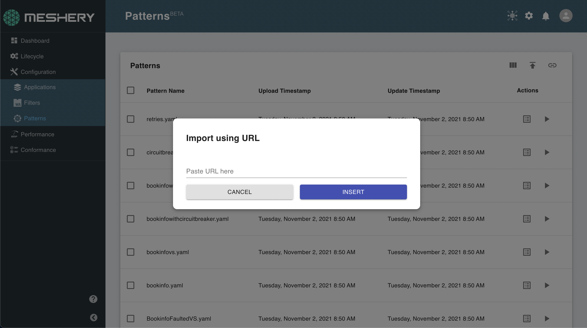

# Creating a Meshery Design

> Learn how to create a Meshery Design using the built-in Design Configurator in Meshery UI or the mesheryctl CLI.

Source: /pr-preview/pr-21670/guides/configuration-management/creating-a-meshery-design/

A Meshery Design is the primary unit of configuration management in Meshery. It is a declarative document that describes the desired state of your infrastructure and applications — the components you want, their configuration, and their relationships. Designs can be deployed, shared, versioned, exported, and imported.

See [Meshery Designs](/pr-preview/pr-21670/concepts/logical/designs/) for a full description of design capabilities.

## Ways to Create a Design

<input id="creating-a-meshery-design-tabs-3-1" type="radio" name="creating-a-meshery-design-tabs-3" checked>
    <label for="creating-a-meshery-design-tabs-3-1"><i class="fa fa-desktop" aria-hidden="true"></i>Meshery UI
    </label>
    <section class="tabbed" id="creating-a-meshery-design-tabs-3-content-1"><h2 id="using-the-design-configurator-in-meshery-ui">
	Using the Design Configurator in Meshery UI
</h2>

The Design Configurator is a built-in tool in Meshery UI. It lets you browse infrastructure categories and models, add components to a design, configure each component through guided forms, and save the resulting design — all without writing YAML by hand.

<h3 id="step-1--open-the-design-configurator">
	Step 1 — Open the Design Configurator
</h3>
<ol>
<li>Log in to Meshery and go to the <strong>Designs</strong> page (left navigation).</li>
<li>Click <strong>+ New Design</strong> (or open an existing design to edit it). 
The Design Configurator opens with an empty canvas and a component panel on the left.</li>
</ol>

Opening the configurator requires the <strong>View Designs</strong> permission, the same key the <strong>Designs</strong> page itself requires. Without it, the configurator shows the permission-denied page rather than the canvas. See <a href="/pr-preview/pr-21670/reference/extensibility/authorization/">Extensibility: Authorization</a>.

<h3 id="step-2--name-your-design">
	Step 2 — Name Your Design
</h3>

Give your design a meaningful name in the <strong>Design Name</strong> field at the top of the configurator. This name is used when saving, sharing, or deploying the design.

<h3 id="step-3--add-components">
	Step 3 — Add Components
</h3>
<ol>
<li>In the <strong>Category</strong> dropdown, select the infrastructure category you want to work with (for example, <em>Kubernetes</em>, <em>AWS</em>, <em>Prometheus</em>).</li>
<li>In the <strong>Model</strong> dropdown, select the specific model within that category (for example, <em>Deployment</em>, <em>Service</em>, <em>ConfigMap</em> within the Kubernetes category).</li>
<li>Click the model or component name to add it to your design. The component appears in the design document on the right.</li>
</ol>

Repeat this process to add as many components as your design requires.

<h3 id="step-4--configure-components">
	Step 4 — Configure Components
</h3>

Click any component in the design panel to open its configuration form. The form is generated from the component&rsquo;s schema and includes:

<ul>
<li>Required fields (highlighted)</li>
<li>Optional fields with defaults</li>
<li>Nested sub-properties (expand to configure)</li>
</ul>

Fill in the fields for your environment. Changes are applied to the design document in real time.

<h3 id="step-5--save-the-design">
	Step 5 — Save the Design
</h3>

Click <strong>Save</strong> (floppy disk icon) to save your design. Meshery stores the design in your account. Use <strong>Save As</strong> to create a copy under a new name.

Your saved design appears on the <strong>Designs</strong> page, where you can deploy, export, share, or further edit it.

<h2 id="using-the-design-configurator-to-edit-yaml-directly">
	Using the Design Configurator to Edit YAML Directly
</h2>

The Design Configurator also exposes a <strong>code editor</strong> panel alongside the form view. If you prefer to write or paste YAML directly:

<ol>
<li>Open or create a design.</li>
<li>Switch to the <strong>YAML/Code</strong> view in the configurator toolbar.</li>
<li>Enter valid Meshery Design YAML (following the <a href="https://github.com/meshery/schemas">Meshery Schemas</a> spec).</li>
<li>Click <strong>Save</strong>.</li>
</ol>

Changes made in the code editor are reflected immediately in the form view, and vice versa.

<h2 id="seed-designs">
	Seed Designs
</h2>

When you start Meshery for the first time, a set of seed designs is available. These cover common Kubernetes patterns and serve as a starting point for exploration.

You can also import community designs from the <a href="https://meshery.io/catalog">Meshery Catalog</a> or from a Git repository.

</section><input id="creating-a-meshery-design-tabs-3-2" type="radio" name="creating-a-meshery-design-tabs-3">
    <label for="creating-a-meshery-design-tabs-3-2"><i class="fa fa-terminal" aria-hidden="true"></i>mesheryctl
    </label>
    <section class="tabbed" id="creating-a-meshery-design-tabs-3-content-2"><h2 id="using-mesheryctl">
	Using mesheryctl
</h2>

You can also create and manage designs from the command line using <code>mesheryctl</code>.

<h3 id="import-a-design-from-a-file">
	Import a design from a file
</h3>

<pre tabindex="0" class="chroma"><code class="language-bash" data-lang="bash">mesheryctl design import -f your-design.yaml
</code></pre>
<h3 id="apply-a-design-by-file">
	Apply a design by file
</h3>

<pre tabindex="0" class="chroma"><code class="language-bash" data-lang="bash">mesheryctl design apply -f your-design.yaml
</code></pre>
<h3 id="apply-an-already-imported-design-by-name">
	Apply an already-imported design by name
</h3>

<pre tabindex="0" class="chroma"><code class="language-bash" data-lang="bash">mesheryctl design apply MyDesignName
</code></pre>
<h3 id="list-saved-designs">
	List saved designs
</h3>

<pre tabindex="0" class="chroma"><code class="language-bash" data-lang="bash">mesheryctl design list
</code></pre>

See the <a href="/pr-preview/pr-21670/reference/references/mesheryctl/design/"><code>mesheryctl design</code> reference</a> for the full subcommand reference.

</section>

## Related

- [Meshery Designs concept](/pr-preview/pr-21670/concepts/logical/designs/)
- [Importing Designs](/pr-preview/pr-21670/guides/configuration-management/importing-models/)
- [Deploying a Design](/pr-preview/pr-21670/guides/configuration-management/working-with-designs/)
- [`mesheryctl design` reference](/pr-preview/pr-21670/reference/references/mesheryctl/design/)
- [Meshery Catalog](https://meshery.io/catalog)
