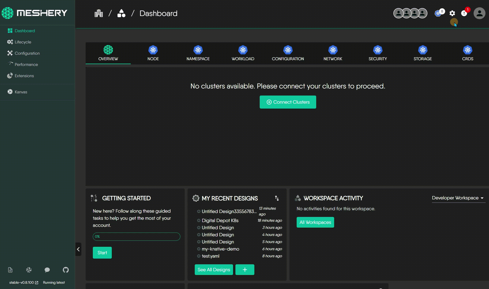
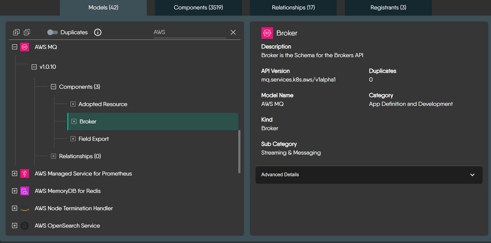
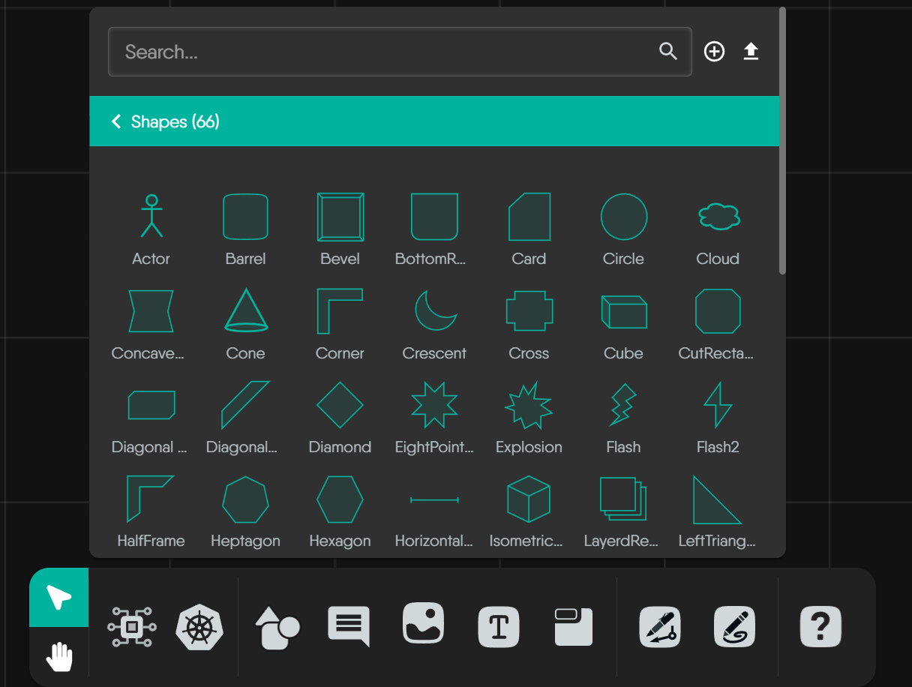
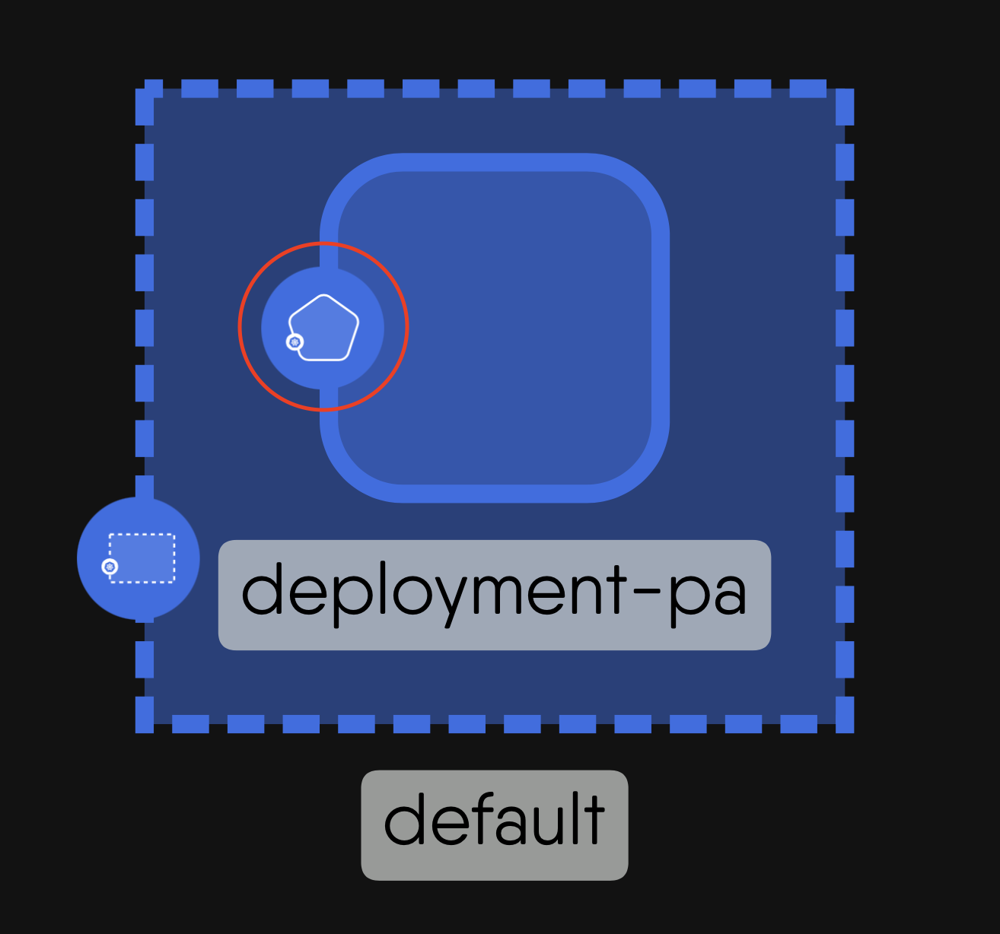
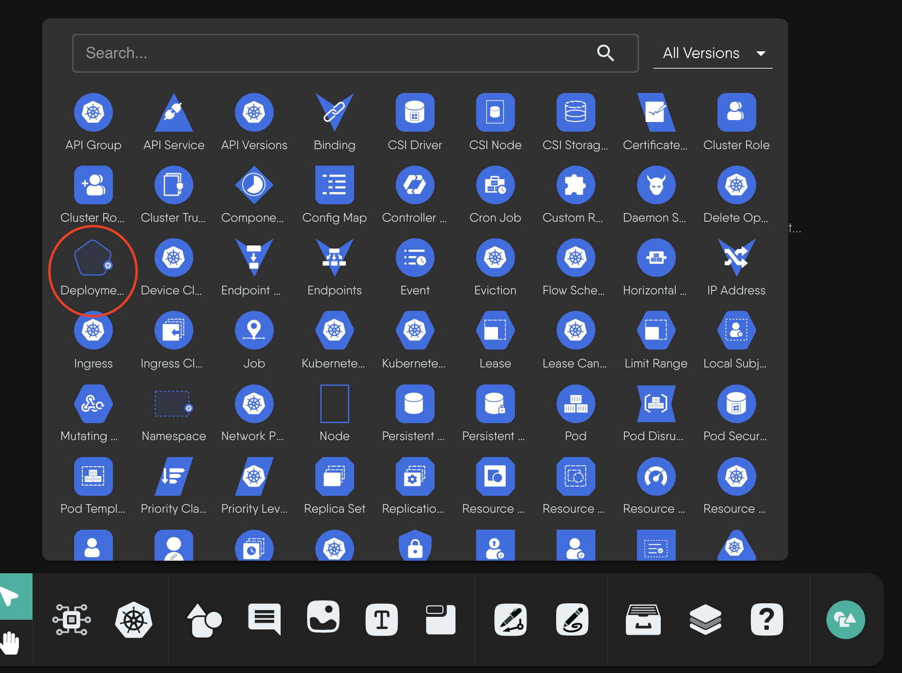

# Identifying Meshery Components

> A guide to help you identify and understand the various component icons, shapes, and visual styles used across the Meshery UI.

Source: /pr-preview/pr-21670/guides/configuration-management/identifying-components/

Ever wondered what the different icons and shapes in Meshery represent? Whether you're looking at a dashboard, a settings page, or a design, you'll encounter a rich library of visual elements. This guide is here to help you understand what they mean.

The [components](/pr-preview/pr-21670/concepts/logical/components/) in Meshery fall into two fundamental categories, distinguished by whether they can be orchestrated (managed) by Meshery during deployment:

- **Semantic Components (Orchestratable):** These represent actual infrastructure resources that Meshery can understand and manage during deployment. Examples include Kubernetes resources (like Pods and Services), databases, and other infrastructure components. Meshery will actively manage their lifecycle during deployment.

- **Non-semantic Components (Annotation):** These are visual elements used for documentation and organization, such as text boxes, arrows, shapes, and comments. Meshery ignores these during deployment as they don't represent actual infrastructure.

Visual Customization

All components, whether semantic or non-semantic, support rich visual customization. For example, you can change the color of a Kubernetes Pod icon, modify its shape, or customize its background - it's all configurable!

## Semantic Components

These components represent real infrastructure that Meshery can manage. They can be either built-in (like Kubernetes components) or custom components that you [create](/pr-preview/pr-21670/guides/configuration-management/creating-models/).

### Kubernetes Components

While Kubernetes components are commonly used, they follow the same principles as all other semantic components. They have a default distinct visual style to help you instantly recognize them:

- **Uniform Color Scheme:** Kubernetes component icons typically use a **distinctive blue background** as a standard identifier.
- **Standardized Icon Structure:** The fundamental structure is consistent: an outer container shape with the blue background, encompassing a unique inner white symbol.
- **Meaningful Inner Symbols:** The white symbol inside each icon is the crucial unique identifier for that specific Kubernetes Kind, often inspired by the core function of the resource.

### Integrated Technologies

Meshery supports various technologies (like AWS, Prometheus, Istio, KEDA, etc.) with their official icons. These components have the same orchestratable capabilities as Kubernetes components.

Exploring All Integrations

This guide covers the visual style of components. For a complete catalog of all technologies that Meshery integrates, visit the integrations directory. <strong><a href='/pr-preview/pr-21670/extensions/models/'>Explore All Integrations</a></strong>

## Non-semantic Components

These components help you document and organize your designs without affecting the actual infrastructure. They include:

- Text boxes and comments for documentation
- Shapes and containers for visual grouping
- Lines and arrows for showing relationships
- Labels and tags for organization

While these components are ignored during deployment, they support the same visual customization options as semantic components.

Edge Components

To learn more about edge components and their visual styles, visit the <strong><a href='/pr-preview/pr-21670/guides/configuration-management/edges-guide/'>Edge Components Guide</a></strong>

## Foundational Elements

In addition to the rich library of predefined icons, Meshery also provides a core set of foundational geometric shapes. These are not tied to any specific technology but are intended for representing abstract concepts or for simple annotations within your designs where a specific component icon doesn't apply.

<strong>Foundational Geometric Shapes</strong>

 
These are the quintessential building blocks for many diagrams – your circles, squares, triangles, and basic polygons. They offer simple, clean, and universally understood forms for a wide range of uses.

  

  
    

      

        
          
        
        
Circle

      

      

        
          
The default shape for nodes, displayed as an oval. This shape is useful for general-purpose nodes where no special distinction is required.

        
      

    

  
    

      

        
          
        
        
Triangle

      

      

        
          
A simple three-sided shape, often used to represent hierarchical data or directional flows. It is useful for indicating movement, direction, or hierarchical relationships within a network.

        
      

    

  
    

      

        
          
        
        
Heptagon

      

      

        
          
A polygon with seven straight sides and angles. This shape is less common but can be used to represent specific or unique data types that require distinction from other polygonal shapes.

        
      

    

  
    

      

        
          
        
        
Pentagon

      

      

        
          
A five-sided polygon often used for specific classifications of data. Its unique shape helps to quickly distinguish it from other polygonal shapes.

        
      

    

  
    

      

        
          
        
        
Round Rectangle

      

      

        
          
Similar to a rectangle but with rounded corners, providing a softer, more approachable look. This shape is often used to visually distinguish nodes from standard rectangular nodes, indicating a special status or different type of data.

        
      

    

  
    

      

        
          
        
        
Round Triangle

      

      

        
          
A triangular shape with rounded corners, providing a softer look while still indicating hierarchy or direction.

        
      

    

  

<strong>Common Representational & Symbolic Shapes</strong>

 
This group includes shapes that, by common convention, often evoke a more specific symbolic meaning, like using a "Barrel" for data storage or an "Actor" for a user role. Leveraging these established visual metaphors can make your custom diagrams more intuitive.

  

  
    

      

        
          
        
        
Barrel

      

      

        
          
A shape resembling a 3D barrel, with both the top and bottom edges appearing rounded. This shape can be used to represent data storage, such as databases or repositories.

        
      

    

  
    

      

        
          
        
        
Tag

      

      

        
          
A shape resembling a label or tag, useful for categorized or labeled data nodes.

        
      

    

  
    

      

        
          
        
        
Round Tag

      

      

        
          
A tag shape with rounded edges, offering a softer visual cue for categorized nodes.

        
      

    

  
    

      

        
          
        
        
TextBox

      

      

        
          
A rectangular shape representing a text entry or display area, useful in diagrams to show nodes that contain text information or comments.

        
      

    

  
    

      

        
          
        
        
Generic Node

      

      

        
          
A simple, often circular or rectangular shape used as a placeholder for unspecified or generic data points.

        
      

    

  

<strong>Specialized & Decorative Geometric Shapes</strong>

 
When your diagrams require a more distinct visual style or an element for emphasis, this collection offers a variety of options, from complex polygons to stylized forms like "Crescent," "Star," or "XWing." These shapes are less commonly used in Meshery and have no universally accepted meaning.

  

  
    

      

        
          
        
        
Bottom Round Rectangle

      

      

        
          
A unique shape where only the bottom corners are rounded. This can be useful to indicate hierarchical relationships or to create a visual distinction from other rounded shapes.

        
      

    

  
    

      

        
          
        
        
Concave Hexagon

      

      

        
          
A six-sided shape with one or more inward curves, creating a star-like appearance, useful for special types of nodes that need to stand out distinctly.

        
      

    

  
    

      

        
          
        
        
Crescent

      

      

        
          
A shape resembling a crescent moon, which can be used to represent phases, growth, or transition nodes within a graph.

        
      

    

  
    

      

        
          
        
        
Cut Rectangle

      

      

        
          
A rectangle with corners that are cut off or beveled. This shape gives a more modern and distinct appearance, often used to highlight important nodes or different types of data.

        
      

    

  
    

      

        
          
        
        
Diamond

      

      

        
          
A four-sided shape oriented at 45 degrees, resembling a diamond. It is typically used for decision points in flowcharts or to represent special conditions or states.

        
      

    

  
    

      

        
          
        
        
Left Triangle

      

      

        
          
A triangular shape pointing to the left, often used to indicate directional flow or hierarchical steps in processes or data sequences.

        
      

    

  
    

      

        
          
        
        
Octagon

      

      

        
          
An eight-sided polygon, providing another option for representing complex data types. The additional sides make it stand out more compared to hexagons or pentagons.

        
      

    

  
    

      

        
          
        
        
Parallelogram

      

      

        
          
A four-sided shape with opposite sides parallel, used to represent data processing steps or functions with directional flow.

        
      

    

  
    

      

        
          
        
        
Rhomboid

      

      

        
          
A quadrilateral with opposite sides parallel but not perpendicular, creating a skewed rectangle look. Useful for depicting relationships that aren&#39;t straightforward or direct.

        
      

    

  
    

      

        
          
        
        
Right Rhomboid

      

      

        
          
A rhomboid where one angle is a right angle, offering a distinctive look for special types of data connections or relationships.

        
      

    

  
    

      

        
          
        
        
Round Diamond

      

      

        
          
A diamond shape with rounded corners, used to indicate special conditions or decision points while maintaining a softer visual appeal.

        
      

    

  
    

      

        
          
        
        
Round Heptagon

      

      

        
          
A seven-sided polygon with rounded corners, less common but useful for unique data representations that require distinction.

        
      

    

  
    

      

        
          
        
        
Round Hexagon

      

      

        
          
A six-sided polygon with rounded corners, providing a less angular look for complex data types.

        
      

    

  
    

      

        
          
        
        
Round Octagon

      

      

        
          
An eight-sided polygon with rounded corners, offering another distinct and less angular representation for complex data.

        
      

    

  
    

      

        
          
        
        
Slanted Parallelogram

      

      

        
          
A four-sided shape with opposite sides parallel but slanted, creating a dynamic appearance often used to indicate processes or flows that have a directional aspect.

        
      

    

  
    

      

        
          
        
        
Star

      

      

        
          
A shape with multiple points radiating outwards, typically used for highlighting special or notable nodes. It draws immediate attention, making it ideal for critical data points or focal nodes.

        
      

    

  
    

      

        
          
        
        
Trapezoid

      

      

        
          
A four-sided shape with one pair of parallel sides, used to indicate hierarchical relationships or steps in a process.

        
      

    

  
    

      

        
          
        
        
Vee

      

      

        
          
A shape resembling the letter &#34;V&#34;, often used to show directionality or a splitting point in flowcharts.

        
      

    

  
    

      

        
          
        
        
XWing

      

      

        
          
This shape resembles the Star Wars X-Wing fighter, potentially useful for visually representing nodes that have multiple connections or interactions, symbolizing complexity and centrality.

        
      

    

  
    

      

        
          
        
        
Polygon

      

      

        
          
A custom point polygon allows the creation of irregular, user-defined polygonal shapes for graph nodes.

        
      

    

  
    

      

        
          
        
        
Plus(Polygon)

      

      

        
          
A polygonal shape with any number of points, allowing for highly customizable node representations to fit specific data needs.

        
      

    

  

## Component Visuals in Different Contexts

To see how this works in practice, let's take the Kubernetes `Deployment` component as an example. Its appearance adapts to different views in the Meshery UI:

1.The full component shape as it appears in a design:

2.The simplified icon as it appears in a component selection panel:

3.The icon as seen in a cluster resource overview:

