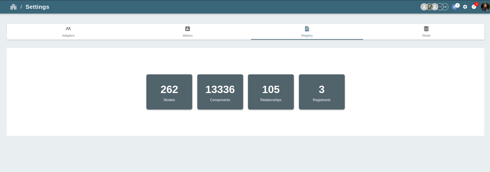
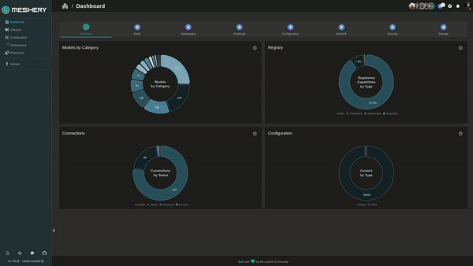

# Importing Models

> Importing Existing Model and CRD-based Infrastructure Configurations into Meshery as Model

Source: /pr-preview/pr-21670/guides/configuration-management/importing-models/

Import your existing Models and existing custom resource definition (CRD) into Meshery. The platform supports a variety of application definition formats, and you can import designs using either the Meshery CLI or the Meshery UI.

**Note:** A [Model](/pr-preview/pr-21670/concepts/logical/models/) can be only imported if it contains at least a valid [Component](/pr-preview/pr-21670/concepts/logical/components/) or [Relationship](/pr-preview/pr-21670/concepts/logical/relationships/).

## Import Models Using Meshery CLI

<div class="alert alert-warning" role="alert"><div class="h4 alert-heading" role="heading">Limitation on Importing Connections</div>


The `mesheryctl model import` command currently supports importing Models containing Components, Relationships, and Policies. Importing Models with `Connection` definitions is not yet supported. This functionality may be added in a future release.
</div>


**Step 1: Install Meshery CLI**

Before you can use the Meshery CLI to import a [Model](/pr-preview/pr-21670/concepts/logical/models/), you must first install it. You can install Meshery CLI by [following the instructions](/pr-preview/pr-21670/installation/#install-mesheryctl).


**Step 2: Import the Model**

Model can imported in 2 different format ```URL, File```.The only cretiria for this import is the model should be a Meshery exported Model.

<pre class="codeblock-pre">
<div class="codeblock"><div class="clipboardjs">mesheryctl model import -f [file/url] </div></div>
</pre>

The supported registrant are `github`,`meshery` and `artifacthub`.The URL format must be in this order.

https://github.com/{owner}/{repo}/raw/refs/heads/main/filename

**Example :**

<pre class="codeblock-pre">
<div class="codeblock"><div class="clipboardjs">mesheryctl model import -f istio-base.tar</div></div>
</pre>

<pre class="codeblock-pre">
<div class="codeblock"><div class="clipboardjs">mesheryctl model import -f "https://github.com/{owner}/{repo}/raw/refs/heads/main/filename"</div></div>
</pre>


## Import Models Using Meshery UI

**Step 1: Access the Meshery UI**

To import a model into Meshery using the Meshery UI, you must first [install Meshery](/pr-preview/pr-21670/installation/quick-start/)

**Step 2: Navigate to Registry under Settings Page**

Once you have accessed the Meshery UI, navigate to the Registry under Settings. This page can be accessed by clicking on the Settings on the top right on setting icon and then selecting "Registry" and then choose model.

<a href="../images/Registry.png"></a>

**Step 3: Upload the Model**

On the Registry page, you can import your model clicking the import button in registry page. Selecting URL or File and then hitting Import

This Meshery model will include components, relationships.

<a href="./images/ImportModel.gif"></a>
