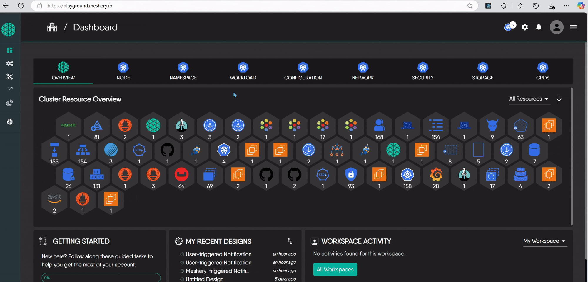
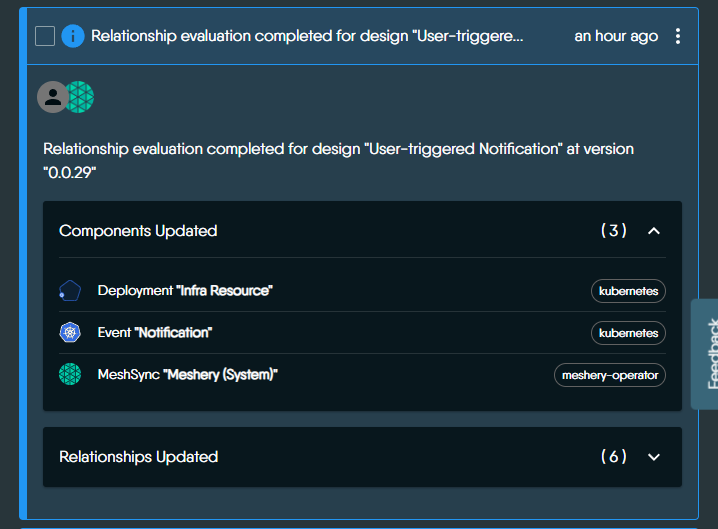
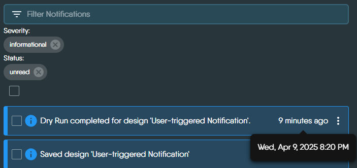
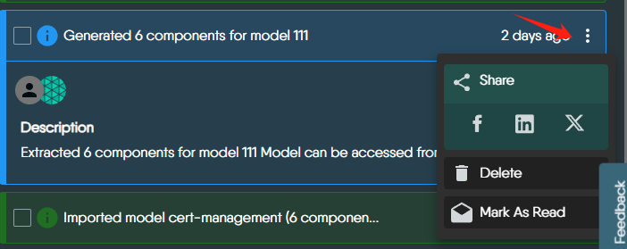
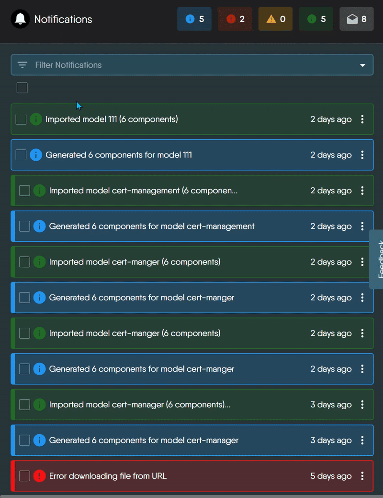
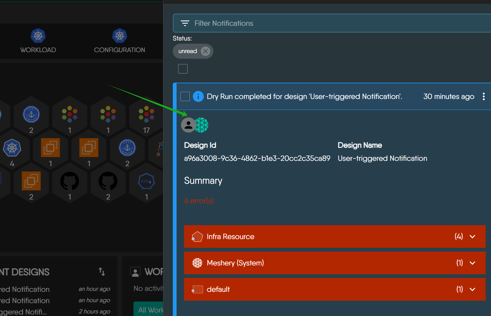

# Managing Events with Notification Center

> Meshery tracks operations performed on your infrastructure and workloads, and provides notification of environment issues, application conflicts with infrastructure configuration, policy violations, and so on.

Source: /pr-preview/pr-21670/guides/infrastructure-management/notification-management/

Meshery continuously tracks activities affecting your infrastructure and workloads. Meshery generates a variety of events, reflecting activities affecting the design and operation of your infrastructure whether those activities are directly or indirectly performed through Meshery operations.

### What is the Notification Center?
The Notification Center is a dedicated panel in Meshery’s UI that helps you monitor, understand, and respond to events across your system. It acts as a central place where you can see important updates related to your infrastructure, workloads, and Meshery’s internal operations.

### Types of Notifications

Given the variety of activities that occur through the process of managing infrastructure, notifications have been grouped into categories so that you can readily understand what a notification means and what do to about any particular type you have received.

Each notification in Meshery includes a clear summary of what occurred in your system. Notifications vary in format depending on the event type, but typically include:

- Action performed (e.g., saved a design, ran a dry run)
- Affected components (e.g., deployments, MeshSync, events)
- Validation results or errors (e.g., invalid values, missing fields)
- Relationship updates (e.g., how components are linked)
- Links to the related design or further details

You can mark notifications as read or unread to stay organized and focused. Meshery highlights critical, actionable events in red, helping you quickly spot and respond to urgent issues.

> 🔗 For more technical details, see the [Contributor Reference](https://docs.meshery.io/project/contributing/contributing-ui-notification-center).

### Notification Timestamps
Each notification includes a timestamp showing when the event happened. The time is displayed based on your local device’s time zone, so it reflects your current time.

### Data Sharing
Need to collaborate?
You can share notifications with teammates or stakeholders in just a few clicks — making it easier to communicate and resolve issues.

### Filtering and Searching

The Notification Center provides a powerful way to filter and search through events. You can narrow down results using filters such as **severity**, **status**, **action**, **category**, and **author**.

> Note: Some filter options such as `action`, `category`, and `author` are dynamically generated based on the notifications your Meshery instance has received. These values are retrieved from the `/api/system/events/types` endpoint.

#### Severity  

Filter notifications based on the level of severity, indicated by icon color and symbol. These levels are defined in the `SEVERITY` constant and styled using `SEVERITY_STYLE`.

| Level        | Code Value       | Icon       | Color (Light Mode)   | Description                     |
|--------------|------------------|------------|----------------------|---------------------------------|
| Info         | `informational`  | ℹ️ InfoIcon | Blue                 | General updates or logs         |
| Warning      | `warning`        | ⚠️ AlertIcon | Yellow               | Potential issues                |
| Error        | `error`          | ❌ ErrorIcon | Red                  | Failures or critical problems   |
| Success      | `success`        | ✅ InfoIcon  | Green                | Successfully completed actions  |

#### Status  
Filter notifications based on whether they have been read. These statuses are defined in `STATUS` and styled using `STATUS_STYLE`.

| Status       | Code Value | Icon          | Description                        |
|--------------|------------|---------------|------------------------------------|
| Read         | `read`     | ReadIcon      | Notifications that have been opened |
| Unread       | `unread`   | EnvelopeIcon  | New or untouched notifications      |

### Understanding Notification Logos and Icons

Meshery uses avatar icons to indicate who triggered a notification and what system was involved. These icons help users quickly understand the origin and nature of each event.

| Icon Type                       | Meaning                                                                 |
|----------------------------------|-------------------------------------------------------------------------|
| Meshery logo only               | System-triggered event – initiated automatically by Meshery (e.g., syncing errors, import failures). |
| User avatar + Meshery logo      | User-triggered event – the user performed an action, and Meshery processed it (e.g., registering a Kubernetes context). |
| User avatar only (rare)         | User-triggered event with no system action involved. |

These icons are generated dynamically using the event’s metadata:
 - If `user_id` is present → shows user avatar.
 - If `system_id` is present → shows Meshery logo.

Visual Representation of System/User-triggered Notifications

   

  <figure>
    <figcaption>
      1. 🟢 Meshery-only (System-triggered) Notification
      <a target="_blank" href="https://playground.meshery.io/extension/meshmap?mode=design&design=a7310bb4-e642-4e4e-807a-dbb602228f07">
        (open in playground)
      </a>
    </figcaption>
  </figure>
  

  

  <figure>
    <figcaption>
      2. 👤+🌐 User + Meshery (User-triggered) Notification
      <a target="_blank" href="https://playground.meshery.io/extension/meshmap?mode=design&design=a96a3008-9c36-4862-b1e3-20cc2c35ca89">
        (open in playground)
      </a>
    </figcaption>
  </figure>
  

  

### Notification Retention and Visibility
**How long are notifications stored?**

The duration for which notifications are retained is determined by the provider you are using (e.g., Meshery Cloud, local Meshery Server).

**What happens when retention ends?** 

In Meshery Cloud, notifications are removed once the provider is updated, helping ensure the event stream reflects the most recent and relevant information.

  <h3>Recent Discussions with "meshery" Tag</h3><ul><li>
          <a href="https://discuss.meshery.io/t/design-meshery-mcp-server-architecture-and-registration-interface/7954" target="_blank" rel="noopener noreferrer">
            Design: Meshery MCP Server architecture and registration interface
          </a>
        </li><li>
          <a href="https://discuss.meshery.io/t/the-meshery-mcp-server-foundation-is-up-lets-agree-on-what-to-build-next/7952" target="_blank" rel="noopener noreferrer">
            The Meshery MCP Server foundation is up, let&#39;s agree on what to build next
          </a>
        </li><li>
          <a href="https://discuss.meshery.io/t/new-intro-topic/7975" target="_blank" rel="noopener noreferrer">
            New intro topic
          </a>
        </li><li>
          <a href="https://discuss.meshery.io/t/meshery-mcp-server-poc-an-ai-agent-managing-kubernetes-through-mcp/7974" target="_blank" rel="noopener noreferrer">
            Meshery MCP Server POC: an AI agent managing Kubernetes through MCP
          </a>
        </li><li>
          <a href="https://discuss.meshery.io/t/approach-for-context-window-aware-retrieval-in-the-ai-adapter-issue-20994/7963" target="_blank" rel="noopener noreferrer">
            Approach for context-window-aware retrieval in the AI Adapter (Issue #20994)
          </a>
        </li><li>
          <a href="https://discuss.meshery.io/t/there-is-some-error-in-running-the-localhost-of-layer5-in-my-server/7818" target="_blank" rel="noopener noreferrer">
            There is some error in running the localhost of layer5 in my server
          </a>
        </li><li>
          <a href="https://discuss.meshery.io/t/rfc-aligning-the-foundation-for-the-meshery-mcp-server/7913" target="_blank" rel="noopener noreferrer">
            RFC: Aligning the Foundation for the Meshery MCP Server
          </a>
        </li><li>
          <a href="https://discuss.meshery.io/t/meshery-development-meeting-august-12th-2026/7948" target="_blank" rel="noopener noreferrer">
            Meshery Development Meeting | August 12th, 2026
          </a>
        </li></ul>

    <a href="https://discuss.meshery.io/tag/meshery" target="_blank" rel="noopener noreferrer">
      View all discussions tagged with <code>meshery</code>
    </a>
  

