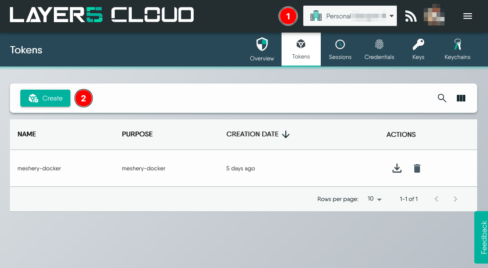
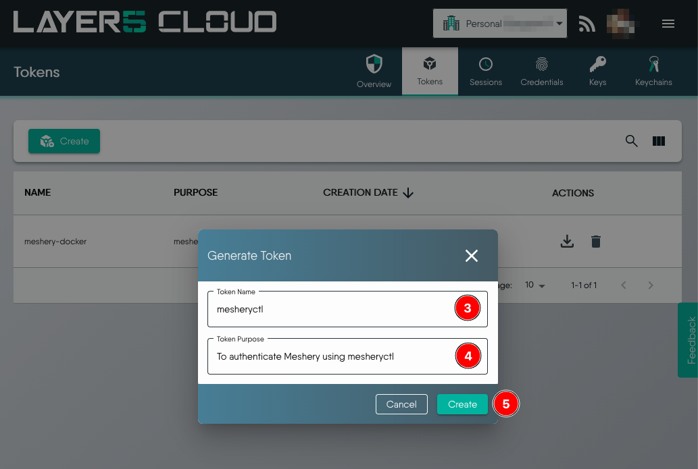
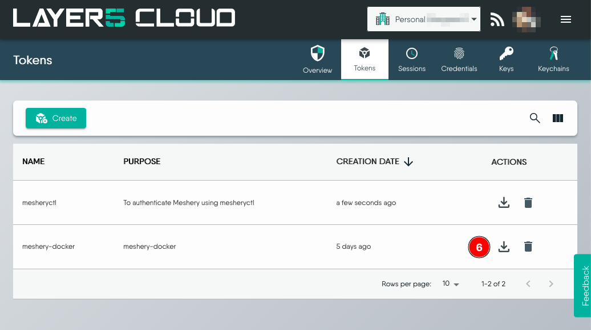

# Authenticating Meshery via CLI

> Get your authentication token from Meshery CLI.

Source: /pr-preview/pr-21670/guides/mesheryctl/authenticate-with-meshery-via-cli/

To authenticate Meshery through `mesheryctl`, the Meshery CLI, you will use the `mesheryctl system login` command. On executing this command, you will be provided with a list of providers to choose from. You can then select a Provider of your choice to complete the authentication and authorization process.

As of this writing, you will be presented with two providers, _Meshery_ and _None_. 
```bash
Use the arrow keys to navigate: ↓ ↑ → ← 
? Select a Provider: 
  ▸ Meshery
    None
```

- Selecting _Meshery_ will open a browser to complete the login and authentication process with Meshery Cloud. On successful authentication, you can close the window and return to the command prompt. 

  Verify that an `auth.json` file was created in the `.meshery` folder in your home directory.

  ```bash
  ls -l $HOME/.meshery/

  total 12
  -rw-rw-r-- 1 ubuntu ubuntu  39 Dec 21 06:13 auth.json
  -rw-rw-r-- 1 ubuntu ubuntu 260 Dec 21 06:04 config.yaml
  -rw-rw-r-- 1 ubuntu ubuntu 988 Dec 21 06:04 meshery.yaml
  ```

  **_The need for authentication to `Meshery` [provider](/pr-preview/pr-21670/reference/extensibility/providers/) is to save your environment setup while also having persistent/steady sessions and to be able to retrieve performance test results._**

- Selecting _None_ will create an empty `auth.json` file. All your work remains local and ephemeral. 

If `mesheryctl` is running in a system that does not have a browser, you can download an auth token file from your Meshery Cloud account and copy it into the `.meshery` folder in your home directory. The following steps show how you can generate and download a token:

1. Navigate to [https://cloud.meshery.io/security/tokens](https://cloud.meshery.io/security/tokens) and sign-in.
Ensure you are in the right organization and click **Create**.

<a href="images/create-token.png"></a>

2. Provide a token name and purpose. Click **Create** to generate.

    <a href="images/generate-token.png"></a>

3. Click the **Download** icon to download the `auth.json` file.

    <a href="images/download-token.png"></a>

Then run `mesheryctl system check` to ensure you do not see an authentication error.   

For an exhaustive list of `mesheryctl` commands and syntax, visit [`mesheryctl` Command Reference](/pr-preview/pr-21670/reference/references/mesheryctl/).

<div class="related-discussions">
  <h3>Recent Discussions with "mesheryctl" Tag</h3><ul><li>
          <a href="https://discuss.meshery.io/t/pairing-up-with-a-meshmate-to-gacefully-start-contributing-to-meshery-and-its-project-ecosystem/6957" target="_blank" rel="noopener noreferrer">
            Pairing up with a Meshmate to gacefully start contributing to Meshery and its project ecosystem
          </a>
        </li><li>
          <a href="https://discuss.meshery.io/t/development-meeting-contributing-to-meshery-cli-april-30-2025/6927" target="_blank" rel="noopener noreferrer">
            [Development Meeting] Contributing to Meshery CLI - April 30, 2025
          </a>
        </li><li>
          <a href="https://discuss.meshery.io/t/meshery-development-meeting-april-30th-2025/6926" target="_blank" rel="noopener noreferrer">
            Meshery Development Meeting | April 30th, 2025
          </a>
        </li><li>
          <a href="https://discuss.meshery.io/t/newcomers-meeting-end-to-end-testing-in-meshery-cli-using-bats-april-17-2025/6897" target="_blank" rel="noopener noreferrer">
            [Newcomers’ Meeting] End-to-End Testing in Meshery CLI using BATs – April 17, 2025
          </a>
        </li><li>
          <a href="https://discuss.meshery.io/t/unable-to-lint-mesheryctl/6854" target="_blank" rel="noopener noreferrer">
            unable to lint mesheryctl 
          </a>
        </li><li>
          <a href="https://discuss.meshery.io/t/mesheryctl-system-login-problem/6687" target="_blank" rel="noopener noreferrer">
            Mesheryctl system login problem
          </a>
        </li><li>
          <a href="https://discuss.meshery.io/t/error-while-launching-the-meshery-dashboard/6600" target="_blank" rel="noopener noreferrer">
            Error while launching the Meshery Dashboard
          </a>
        </li><li>
          <a href="https://discuss.meshery.io/t/cant-find-the-file-path-for-meshery-designs/6319" target="_blank" rel="noopener noreferrer">
            Can&#39;t find the file path for meshery designs
          </a>
        </li></ul><p>
    <a href="https://discuss.meshery.io/tag/mesheryctl" target="_blank" rel="noopener noreferrer">
      View all discussions tagged with <code>mesheryctl</code>
    </a>
  </p>
</div>
