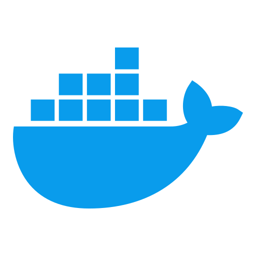
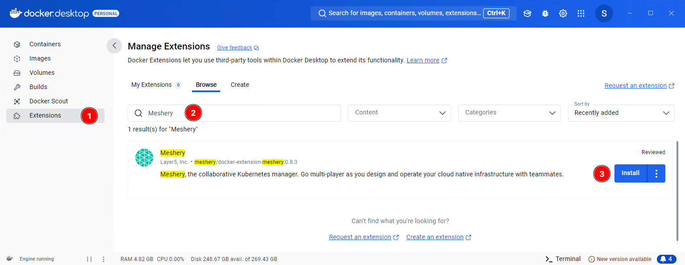
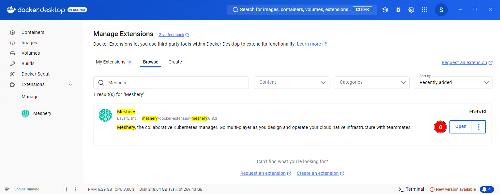
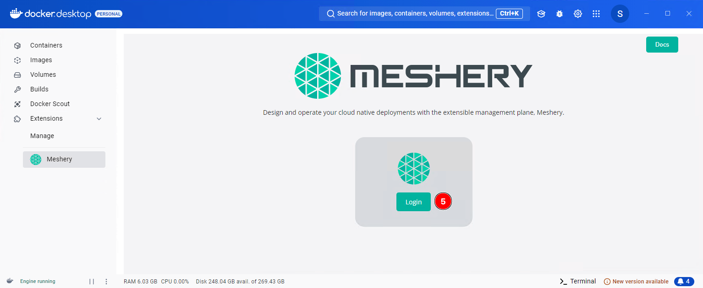
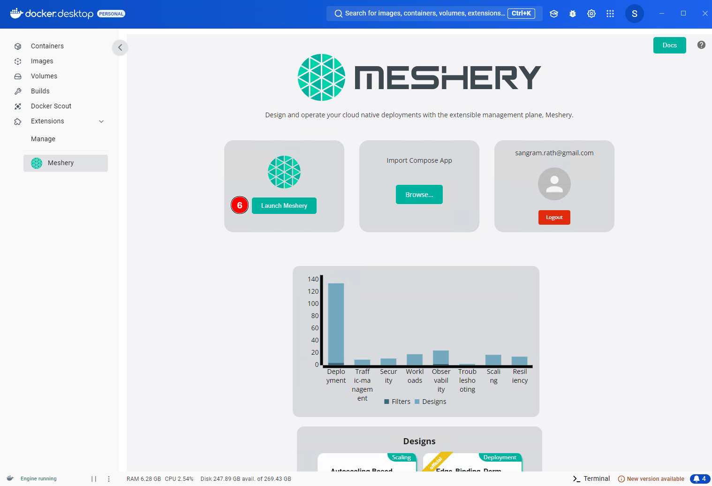
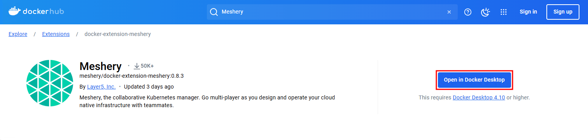
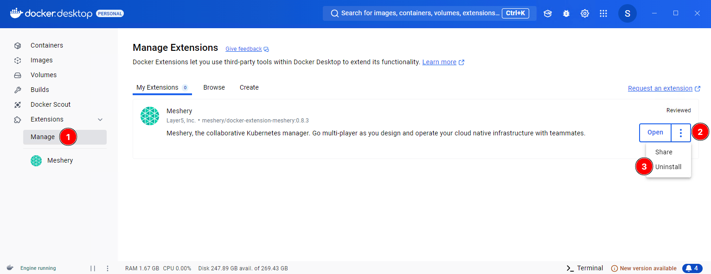

# Docker Extension

> Install Docker Extension for Meshery

Source: /pr-preview/pr-21670/installation/docker/docker-extension/

<h1>Quick Start with Docker Extension </h1>

The Docker Extension for Meshery extends Docker Desktop's position as the developer's go-to Kubernetes environment with easy access to the full capabilities of Meshery's collaborative cloud native management features.

## Prerequisites

- You need Docker Desktop version of 4.10 or higher for this.
- This document applies only when Docker Desktop uses kubeadm with Kubernetes enabled. If you are using kind, please refer to the [Kind](/pr-preview/pr-21670/installation/kubernetes/kind/) section.

## Install the Docker Meshery Extension

Select one of the following three options to install the Docker Meshery Extension:

- [Prerequisites](#prerequisites)
- [Install the Docker Meshery Extension](#install-the-docker-meshery-extension)
  - [Using Docker Desktop](#using-docker-desktop)
  - [Using Docker Hub](#using-docker-hub)
  - [Using Docker CLI](#using-docker-cli)
- [Remove Meshery as a Docker Extension](#remove-meshery-as-a-docker-extension)
  - [Removing from Docker Desktop](#removing-from-docker-desktop)
  - [Removing using Docker CLI](#removing-using-docker-cli)
  - [Additional Cleanup](#additional-cleanup)

### Using Docker Desktop

Navigate to the **Extensions** marketplace of Docker Desktop. Search for Meshery and click the Install button to install the extension.

Click **Open** when installation is done or click **Meshery** on the left under **Extensions**.

Click **Login** to open the _Meshery Cloud_ login page. Log in or sign up and you will be redirected back to Docker Desktop.

Finally, click **Launch Meshery** to load Meshery Dashboard in a browser window. It runs at http://localhost:9081/ by default.

You can also open http://localhost:9081/ directly on a browser on the local machine after installing the Docker extension and complete the _Meshery Cloud_ login process to achieve the same result.

### Using Docker Hub

Another way to install the Meshery Docker Extension is from the Docker Hub. Navigate to the [Meshery Docker Extension](https://hub.docker.com/extensions/meshery/docker-extension-meshery) page and click Open in Docker Desktop to get started. Once installed, the rest of the process is same as above.

### Using Docker CLI

Finally, you can also install the Meshery Docker Extension using the Docker CLI. Follow the commands in the clipboard below. 

<!--
docker extension install meshery/docker-extension-meshery -->
<!--  -->

<pre class="codeblock-pre" style="padding: 0; font-size: 0px;">
  

    <!-- Updated style for clipboardjs -->
    

      docker extension install meshery/docker-extension-meshery 
    

    

    

      docker extension install meshery/docker-extension-meshery
      
      Successfully installed Meshery
      mesheryctl system dashboard
    

  

</pre>

It runs as a set of one or more containers inside your Docker Desktop virtual machine.

Finally, you can now fully utilize Meshery to manage and monitor your cloud-native infrastructure.

## Remove Meshery as a Docker Extension

You can remove the Docker Extension from the Docker Desktop interface or from the CLI. 

### Removing from Docker Desktop

Navigate to **Manage** under Extensions, click the ellipsis button (three vertical dots) and select **Uninstall**.

### Removing using Docker CLI

To remove the extension from the command line, use the `docker extension rm` command.

<pre class="codeblock-pre">
	

		<code class="clipboardjs">$ docker extension rm meshery/docker-extension-meshery</code>
	

</pre>

### Additional Cleanup

There could be residual images and networks to remove after removing/uninstalling the extension. Follow the steps below to do so. 

**Remove Meshery Images (if necessary)**

Meshery pulls Docker images for deploying the extension and there could be additional Meshery images based on how it was configured. You can remove these images using the `docker rmi` command. Start by listing all the images and then running the command for each image you want to remove. For example:

<pre class="codeblock-pre">
	

		<code class="clipboardjs">docker rmi meshery/meshery:stable-latest</code>
	

</pre>

**Remove Meshery Docker Networks (if necessary)**

Meshery creates custom Docker networks, and they could still be left after the extension uninstall. These can be removed using the `docker network rm` command. For example:

<pre class="codeblock-pre">
	

		<code class="clipboardjs">docker network rm meshery_default</code>
	

</pre>

  <h3>Recent Discussions with "meshery" Tag</h3><ul><li>
          <a href="https://discuss.meshery.io/t/design-meshery-mcp-server-architecture-and-registration-interface/7954" target="_blank" rel="noopener noreferrer">
            Design: Meshery MCP Server architecture and registration interface
          </a>
        </li><li>
          <a href="https://discuss.meshery.io/t/the-meshery-mcp-server-foundation-is-up-lets-agree-on-what-to-build-next/7952" target="_blank" rel="noopener noreferrer">
            The Meshery MCP Server foundation is up, let&#39;s agree on what to build next
          </a>
        </li><li>
          <a href="https://discuss.meshery.io/t/new-intro-topic/7975" target="_blank" rel="noopener noreferrer">
            New intro topic
          </a>
        </li><li>
          <a href="https://discuss.meshery.io/t/meshery-mcp-server-poc-an-ai-agent-managing-kubernetes-through-mcp/7974" target="_blank" rel="noopener noreferrer">
            Meshery MCP Server POC: an AI agent managing Kubernetes through MCP
          </a>
        </li><li>
          <a href="https://discuss.meshery.io/t/approach-for-context-window-aware-retrieval-in-the-ai-adapter-issue-20994/7963" target="_blank" rel="noopener noreferrer">
            Approach for context-window-aware retrieval in the AI Adapter (Issue #20994)
          </a>
        </li><li>
          <a href="https://discuss.meshery.io/t/there-is-some-error-in-running-the-localhost-of-layer5-in-my-server/7818" target="_blank" rel="noopener noreferrer">
            There is some error in running the localhost of layer5 in my server
          </a>
        </li><li>
          <a href="https://discuss.meshery.io/t/rfc-aligning-the-foundation-for-the-meshery-mcp-server/7913" target="_blank" rel="noopener noreferrer">
            RFC: Aligning the Foundation for the Meshery MCP Server
          </a>
        </li><li>
          <a href="https://discuss.meshery.io/t/meshery-development-meeting-august-12th-2026/7948" target="_blank" rel="noopener noreferrer">
            Meshery Development Meeting | August 12th, 2026
          </a>
        </li></ul>

    <a href="https://discuss.meshery.io/tag/meshery" target="_blank" rel="noopener noreferrer">
      View all discussions tagged with <code>meshery</code>
    </a>
  

