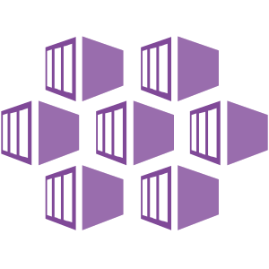

# AKS

> Manage your AKS clusters with Meshery. Deploy Meshery in AKS in-cluster or out-of-cluster.

Source: /pr-preview/pr-21670/installation/kubernetes/aks/

<h1>Quick Start with AKS </h1>

Manage your AKS clusters with Meshery. Deploy Meshery in AKS [in-cluster](#in-cluster-installation) or outside of AKS [out-of-cluster](#out-of-cluster-installation). **_Note: It is advisable to install Meshery in your AKS clusters_**

<h4>Prerequisites</h4>
<ol>
<li>Install the Meshery command line client, <a href="/pr-preview/pr-21670/installation/mesheryctl/" class="meshery-light">mesheryctl</a>.</li>
<li>Install <a href="https://kubernetes.io/docs/tasks/tools/">kubectl</a> on your local machine.</li>
<li>Install <a href="https://learn.microsoft.com/en-us/cli/azure/install-azure-cli">Azure CLI</a>, configured for your environment.</li>
<li>Access to an active AKS cluster in one of your resource groups.</li>
</ol>

Also see: [Install Meshery on Kubernetes](/pr-preview/pr-21670/installation/kubernetes/)

## Available Deployment Methods

- [In-cluster Installation](#in-cluster-installation)
    - [Preflight Checks](#preflight-checks)
    - [Preflight: Cluster Connectivity](#preflight-cluster-connectivity)
    - [Installation: Using `mesheryctl`](#installation-using-mesheryctl)
    - [Installation: Using Helm](#installation-using-helm)
  - [Post-Installation Steps](#post-installation-steps)

# In-cluster Installation

Follow the steps below to install Meshery in your AKS cluster.

### Preflight Checks

Read through the following considerations prior to deploying Meshery on AKS.

### Preflight: Cluster Connectivity

1. Verify you connection to an Azure Kubernetes Services Cluster using Azure CLI.
1. Login to Azure account using [az login](https://learn.microsoft.com/en-us/cli/azure/authenticate-azure-cli).
1. After a successful login, identify the subscription associated with your AKS cluster:

<pre class="codeblock-pre">
	

		<code class="clipboardjs">az account set --subscription [SUBSCRIPTION_ID]</code>
	

</pre>

1. After setting the subscription, set the cluster context.

<pre class="codeblock-pre">
	

		<code class="clipboardjs">az aks get-credentials --resource-group [RESOURCE_GROUP] --name [AKS_SERVICE_NAME]</code>
	

</pre>

### Installation: Using `mesheryctl`

Use Meshery's CLI to streamline your connection to your AKS cluster. Configure Meshery to connect to your AKS cluster by executing:

<pre class="codeblock-pre">
	

		<code class="clipboardjs">mesheryctl system config aks</code>
	

</pre>

Once configured, execute the following command to start Meshery.

<pre class="codeblock-pre">
	

		<code class="clipboardjs">mesheryctl system start</code>
	

</pre>

If you encounter any authentication issues, you can use `mesheryctl system login`. For more information, click [here](/pr-preview/pr-21670/guides/mesheryctl/authenticate-with-meshery-via-cli/) to learn more.

### Installation: Using Helm

For detailed instructions on installing Meshery using Helm V3, please refer to the [Helm Installation](/pr-preview/pr-21670/installation/kubernetes/helm/) guide.

## Post-Installation Steps

Optionally, you can verify the health of your Meshery deployment, using <a href='/pr-preview/pr-21670/reference/references/mesheryctl/system/check/'>mesheryctl system check</a>.

You're ready to use Meshery! Open your browser and navigate to the Meshery UI.

  <h3>Recent Discussions with "meshery" Tag</h3><ul><li>
          <a href="https://discuss.meshery.io/t/design-meshery-mcp-server-architecture-and-registration-interface/7954" target="_blank" rel="noopener noreferrer">
            Design: Meshery MCP Server architecture and registration interface
          </a>
        </li><li>
          <a href="https://discuss.meshery.io/t/the-meshery-mcp-server-foundation-is-up-lets-agree-on-what-to-build-next/7952" target="_blank" rel="noopener noreferrer">
            The Meshery MCP Server foundation is up, let&#39;s agree on what to build next
          </a>
        </li><li>
          <a href="https://discuss.meshery.io/t/new-intro-topic/7975" target="_blank" rel="noopener noreferrer">
            New intro topic
          </a>
        </li><li>
          <a href="https://discuss.meshery.io/t/meshery-mcp-server-poc-an-ai-agent-managing-kubernetes-through-mcp/7974" target="_blank" rel="noopener noreferrer">
            Meshery MCP Server POC: an AI agent managing Kubernetes through MCP
          </a>
        </li><li>
          <a href="https://discuss.meshery.io/t/approach-for-context-window-aware-retrieval-in-the-ai-adapter-issue-20994/7963" target="_blank" rel="noopener noreferrer">
            Approach for context-window-aware retrieval in the AI Adapter (Issue #20994)
          </a>
        </li><li>
          <a href="https://discuss.meshery.io/t/there-is-some-error-in-running-the-localhost-of-layer5-in-my-server/7818" target="_blank" rel="noopener noreferrer">
            There is some error in running the localhost of layer5 in my server
          </a>
        </li><li>
          <a href="https://discuss.meshery.io/t/rfc-aligning-the-foundation-for-the-meshery-mcp-server/7913" target="_blank" rel="noopener noreferrer">
            RFC: Aligning the Foundation for the Meshery MCP Server
          </a>
        </li><li>
          <a href="https://discuss.meshery.io/t/meshery-development-meeting-august-12th-2026/7948" target="_blank" rel="noopener noreferrer">
            Meshery Development Meeting | August 12th, 2026
          </a>
        </li></ul>

    <a href="https://discuss.meshery.io/tag/meshery" target="_blank" rel="noopener noreferrer">
      View all discussions tagged with <code>meshery</code>
    </a>
  

