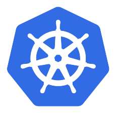

# Install on Kubernetes

> Install Meshery on Kubernetes. Deploy Meshery in Kubernetes in-cluster or outside of Kubernetes out-of-cluster.

Source: /pr-preview/pr-21670/installation/kubernetes/

<h1>Quick Start with Kubernetes </h1>

Manage your Kubernetes clusters with Meshery. Deploy Meshery in Kubernetes [in-cluster](#in-cluster-installation) or outside of Kubernetes [out-of-cluster](#out-of-cluster-installation). **_Note: It is advisable to install Meshery in your Kubernetes clusters_**

<h4>Prerequisites</h4>
  <ol>
    <li>Install the Meshery command line client, <a href="/pr-preview/pr-21670/installation/mesheryctl/" class="meshery-light">mesheryctl</a>.</li>
    <li>Install <a href="https://kubernetes.io/docs/tasks/tools/">kubectl</a> on your local machine.</li>
    <li>Access to an active Kubernetes cluster.</li>
  </ol>

## Available Deployment Methods

- [In-cluster Installation](#in-cluster-installation)
  - [Preflight Checks](#preflight-checks)
    - [Preflight: Cluster Connectivity](#preflight-cluster-connectivity)
  - [Installation: Using `mesheryctl`](#installation-using-mesheryctl)
  - [Installation: Using Helm](#installation-using-helm)
  - [Post-Installation Steps](#post-installation-steps)
  - [Exposing Meshery Service (LoadBalancer) {#exposing-meshery-serviceloadbalancer}](#exposing-meshery-service-loadbalancer-exposing-meshery-serviceloadbalancer)
- [Out-of-cluster Installation](#out-of-cluster-installation)
  - [Set up Ingress on Minikube with the NGINX Ingress Controller](#set-up-ingress-on-minikube-with-the-nginx-ingress-controller)
  - [Installing cert-manager with kubectl](#installing-cert-manager-with-kubectl)
    - [See Also](#see-also)

# In-cluster Installation

Follow the steps below to install Meshery in your Kubernetes cluster.

## Preflight Checks

Read through the following considerations prior to deploying Meshery on Kubernetes.

### Preflight: Cluster Connectivity

Verify your kubeconfig's current context is set to the Kubernetes cluster you want to deploy Meshery to.

<pre class="codeblock-pre">
	

		<code class="clipboardjs">kubectl config current-context</code>
	

</pre>

## Installation: Using `mesheryctl`

Once configured, execute the following command to start Meshery.

Before executing the below command, go to ~/.meshery/config.yaml and ensure that the current platform is set to Kubernetes.

<pre class="codeblock-pre">
	

		<code class="clipboardjs">mesheryctl system start</code>
	

</pre>

## Installation: Using Helm

For detailed instructions on installing Meshery using Helm V3, please refer to the [Helm Installation](/pr-preview/pr-21670/installation/kubernetes/helm/) guide.

## Post-Installation Steps

Optionally, you can verify the health of your Meshery deployment using <a href='/pr-preview/pr-21670/reference/references/mesheryctl/system/check/'>mesheryctl system check</a>.

You're ready to use Meshery! Open your browser and navigate to the Meshery UI.

<h2>Accessing Meshery UI</h2>

After successfully deploying Meshery, you can access Meshery's web-based user interface. Your default browser will automatically open and navigate to Meshery UI (default location is <a href="http://localhost:9081">http://localhost:9081</a>).

You can use the following command to open Meshery UI in your default browser:

<pre class="codeblock-pre" style="font-size: 1.75rem !important;">

<code class="clipboardjs">mesheryctl system dashboard</code>

</pre>

If you have installed Meshery on Kubernetes or a remote host, you can access Meshery UI by exposing it as a Kubernetes service or by port forwarding to Meshery UI.

<pre class="codeblock-pre" style="font-size: 1.75rem !important;">

<code class="clipboardjs">mesheryctl system dashboard --port-forward</code>

</pre>

Depending on how you have networking configured in Kubernetes, you can use kubectl to port forward to the Meshery UI.

<pre class="codeblock-pre" style="font-size: 1.75rem !important;">

<code class="clipboardjs">kubectl port-forward svc/meshery 9081:9081 --namespace meshery</code>

</pre>

<h4>Verify Kubernetes Connection</h4>

After installing Meshery, regardless of the installation type, it is important to verify that your kubeconfig file has been uploaded correctly via the UI. 

<ol>
<li>In the Meshery UI, navigate to <strong>Lifecycle</strong> from the menu on the left.</li>
<li>Click on Connections.</li>
<li>Ensure that your cluster appears in the list of connections and is marked as <code>Connected</code>.</li>
<li>Click on the cluster name to perform a ping test and confirm that Meshery can communicate with your cluster.</li>
</ol>

Customizing Your Meshery Provider Callback URL

  Meshery Server supports customizing your <a href="/pr-preview/pr-21670/reference/extensibility/providers/">Meshery Provider</a> authentication flow callback URL. This is helpful when deploying Meshery behind multiple layers of networking infrastructure.

  For production deployments, it is recommended to access the Meshery UI by setting up a reverse proxy or using a LoadBalancer. By specifying a custom redirect endpoint, you can ensure that authentication flows complete successfully, even when multiple routing layers are involved.

  <b>Note</b>: For production deployments, it is important to select the <code>Remote Provider</code> in order to control which identity providers are authorized. Learn more about this in the <a href="/pr-preview/pr-21670/reference/extensibility/providers/">Extensibility: Providers</a> guide.

  Define a custom callback URL by setting up the <code>MESHERY_SERVER_CALLBACK_URL</code> environment variable before installing Meshery.

  To customize the authentication flow callback URL, use the following command:

<pre class="codeblock-pre" style="font-size: 1.75rem !important;">

<code class="clipboardjs">MESHERY_SERVER_CALLBACK_URL=https://custom-host mesheryctl system start</code>

</pre>

  Meshery should now be running in your Kubernetes cluster and the Meshery UI should be accessible at the <code>EXTERNAL IP</code> of the <code>meshery</code> service.

## Exposing Meshery Service (LoadBalancer) {#exposing-meshery-serviceloadbalancer}

When Meshery is installed in-cluster, Meshery UI is served by a Kubernetes `Service` named `meshery` in the `meshery` namespace. This `Service` is created as type `LoadBalancer` by default, forwarding port `9081` (Meshery UI) to the Meshery Server container on port `8080`.

On a managed Kubernetes offering - such as GKE, EKS, AKS, or DigitalOcean Kubernetes - a `LoadBalancer` `Service` instructs the cloud provider to provision an external load balancer and assign it a routable `EXTERNAL-IP`. Retrieve the address with:

<pre class="codeblock-pre">
	

		<code class="clipboardjs">kubectl get service meshery --namespace meshery</code>
	

</pre>

Once the `EXTERNAL-IP` column shows an address instead of `<pending>`, open Meshery UI in your browser at `http://[EXTERNAL-IP]:9081`.

If the `Service` was previously set to another type (for example, `ClusterIP`), switch it back to `LoadBalancer`:

<pre class="codeblock-pre">
	

		<code class="clipboardjs">kubectl patch service meshery --namespace meshery --type merge -p &#39;{&#34;spec&#34;:{&#34;type&#34;:&#34;LoadBalancer&#34;}}&#39;</code>
	

</pre>

EXTERNAL-IP not assigned?

A `LoadBalancer` `Service` is only assigned an external address when the cluster runs a load balancer controller. Managed clouds provide one out of the box; bare-metal and local clusters (for example, Minikube or kind) do not. On those clusters, install a load balancer implementation such as [MetalLB](https://metallb.universe.tf/), expose Meshery through a `NodePort` `Service` instead, or reach the UI with port-forwarding by following the [mesheryctl system dashboard](/pr-preview/pr-21670/reference/references/mesheryctl/system/dashboard/) guide.

# Out-of-cluster Installation

Install Meshery on Docker (out-of-cluster) and connect it to your Kubernetes cluster.

<!-- ## Installation: Upload Config File in Meshery Web UI

- Run the below command to generate the _"config_minikube.yaml"_ file for your cluster:

 <pre class="codeblock-pre">

 
kubectl config view --minify --flatten > config_minikube.yaml

 </pre>

- Upload the generated config file by navigating to _Settings > Environment > Out of Cluster Deployment_ in the Web UI and using the _"Upload kubeconfig"_ option. -->

## Set up Ingress on Minikube with the NGINX Ingress Controller

- Run the below command to enable the NGINX Ingress controller for your cluster:

<pre class="codeblock-pre">
	

		<code class="clipboardjs">minikube addons enable ingress</code>
	

</pre>

- To check if NGINX Ingress controller is running

<pre class="codeblock-pre">
	

		<code class="clipboardjs">kubectl get pods -n ingress-nginx</code>
	

</pre>

## Installing cert-manager with kubectl

- Run the below command to install cert-manager for your cluster:

<pre class="codeblock-pre">
	

		<code class="clipboardjs">kubectl apply -f https://github.com/cert-manager/cert-manager/releases/download/v1.15.3/cert-manager.yaml</code>
	

</pre>

  <h3>Recent Discussions with "meshery" Tag</h3><ul><li>
          <a href="https://discuss.meshery.io/t/design-meshery-mcp-server-architecture-and-registration-interface/7954" target="_blank" rel="noopener noreferrer">
            Design: Meshery MCP Server architecture and registration interface
          </a>
        </li><li>
          <a href="https://discuss.meshery.io/t/the-meshery-mcp-server-foundation-is-up-lets-agree-on-what-to-build-next/7952" target="_blank" rel="noopener noreferrer">
            The Meshery MCP Server foundation is up, let&#39;s agree on what to build next
          </a>
        </li><li>
          <a href="https://discuss.meshery.io/t/new-intro-topic/7975" target="_blank" rel="noopener noreferrer">
            New intro topic
          </a>
        </li><li>
          <a href="https://discuss.meshery.io/t/meshery-mcp-server-poc-an-ai-agent-managing-kubernetes-through-mcp/7974" target="_blank" rel="noopener noreferrer">
            Meshery MCP Server POC: an AI agent managing Kubernetes through MCP
          </a>
        </li><li>
          <a href="https://discuss.meshery.io/t/approach-for-context-window-aware-retrieval-in-the-ai-adapter-issue-20994/7963" target="_blank" rel="noopener noreferrer">
            Approach for context-window-aware retrieval in the AI Adapter (Issue #20994)
          </a>
        </li><li>
          <a href="https://discuss.meshery.io/t/there-is-some-error-in-running-the-localhost-of-layer5-in-my-server/7818" target="_blank" rel="noopener noreferrer">
            There is some error in running the localhost of layer5 in my server
          </a>
        </li><li>
          <a href="https://discuss.meshery.io/t/rfc-aligning-the-foundation-for-the-meshery-mcp-server/7913" target="_blank" rel="noopener noreferrer">
            RFC: Aligning the Foundation for the Meshery MCP Server
          </a>
        </li><li>
          <a href="https://discuss.meshery.io/t/meshery-development-meeting-august-12th-2026/7948" target="_blank" rel="noopener noreferrer">
            Meshery Development Meeting | August 12th, 2026
          </a>
        </li></ul>

    <a href="https://discuss.meshery.io/tag/meshery" target="_blank" rel="noopener noreferrer">
      View all discussions tagged with <code>meshery</code>
    </a>
  

### See Also 
