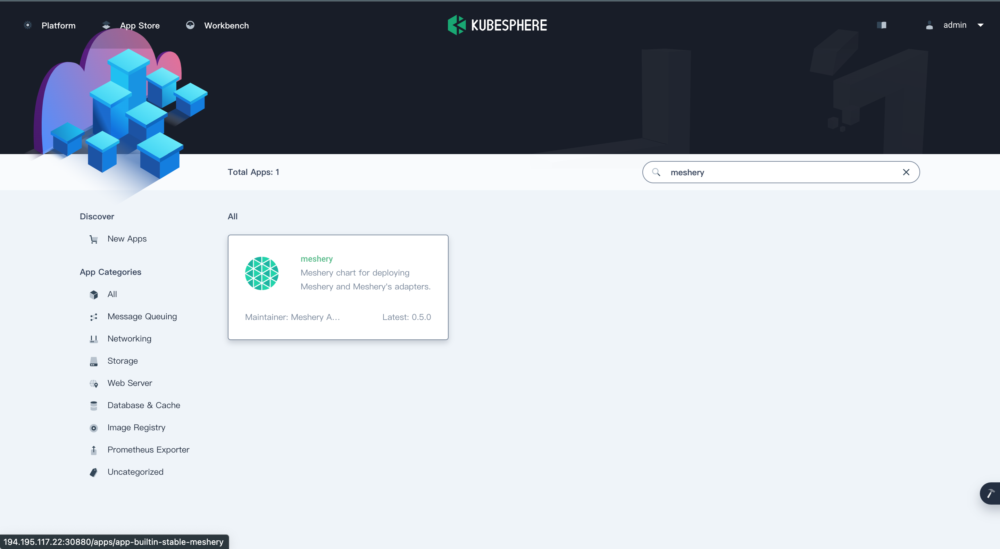
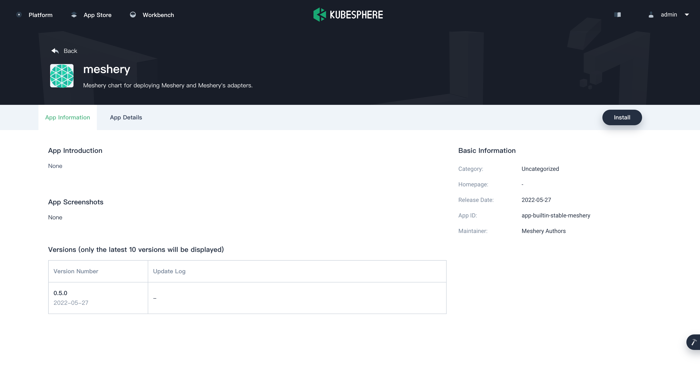
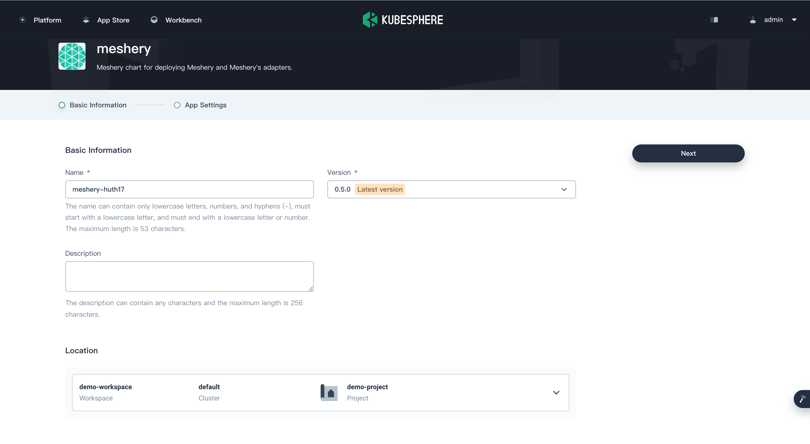
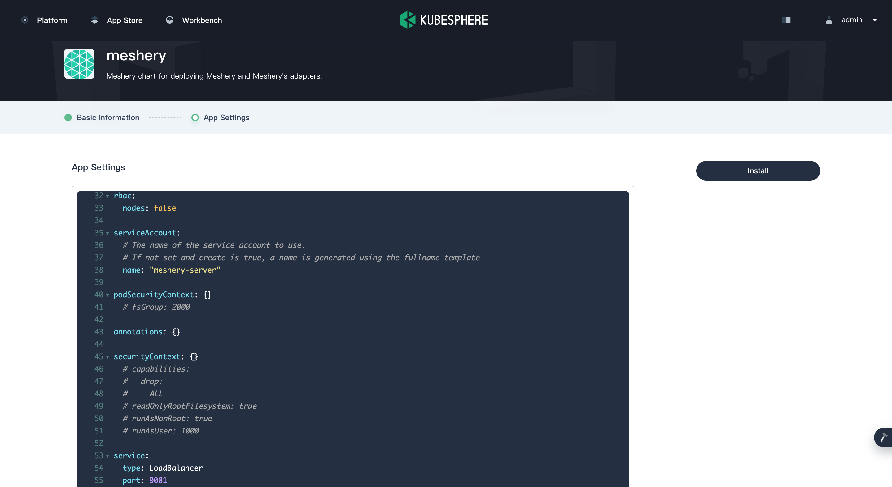
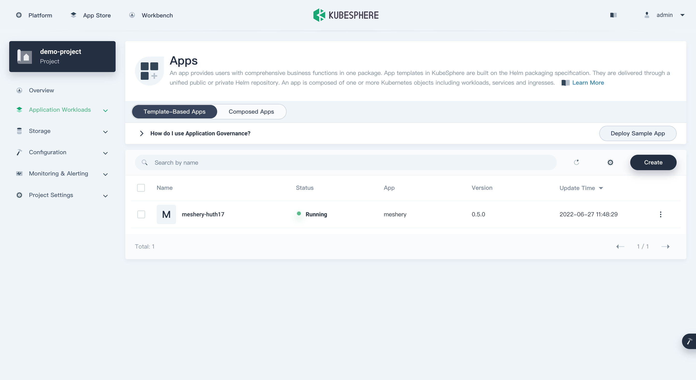
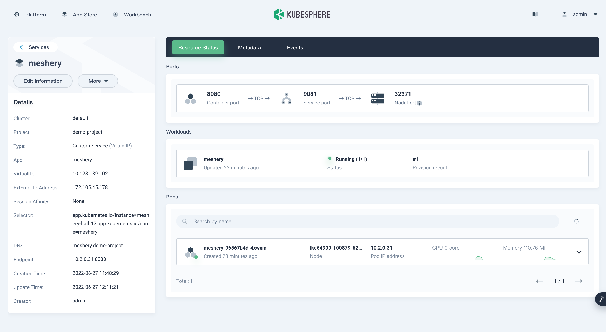
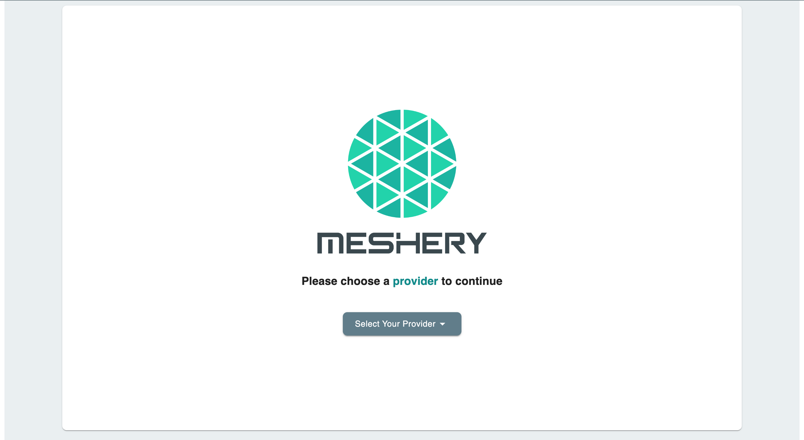

# KubeSphere

> Install Meshery on KubeSphere

Source: /pr-preview/pr-21670/installation/kubernetes/kubesphere/

<h1>Quick Start with KubeSphere </h1>

<h4>Prerequisites</h4>

1. Install the Meshery command line client, 
<a href="/pr-preview/pr-21670/installation/mesheryctl/" class="meshery-light">
    mesheryctl
</a>.

[Meshery](https://meshery.io/) is the open source, cloud native management plane that enables the adoption, operation, and management of Kubernetes, all kinds of cloud native infrastructure, and their workloads.

This tutorial walks you through an example of deploying Meshery from the App Store of KubeSphere.

## Prerequisites

- Please make sure you enable the OpenPitrix system.
- You need to create a workspace, a project, and a user account (`project-regular`) for this tutorial. The account needs to be a platform regular user and to be invited as the project operator with the `operator` role. In this tutorial, you log in as `project-regular` and work in the project `demo-project` in the workspace `demo-workspace`. For more information, see Create Workspaces, Projects, Users and Roles.

## Hands-on Lab

Perform the following steps in order:

### 1. <b>Deploy Meshery from the App Store</b>

1. On the **Overview** page of the project `demo-project`, click **App Store** in the upper-left corner.
2. Search for **Meshery** in the App Store, and click on the search result to open the app.

    
3. In the **App Information** page, click **Install** on the upper right corner.

    

4. In the App Settings page, set the application **Name**, **Location** (as your namespace), and **App Version**, then click **Next** on the upper right corner.

    

5. Configure the **values.yaml** file as needed, or click **Install** to use the default configuration.

    

6. Wait for the deployment to be finished. Upon completion, **Meshery** will be shown as **Running** in KubeSphere.

    

### 2. <b>Access the Meshery Dashboard</b>

1. Go to **Services** and click the service name of Meshery.
2. In the **Resource Status** page, copy the **NodePort** of Meshery.

    

3. Access the Meshery Dashboard by entering **${NodeIP}:${NODEPORT}** in your browser.

    

  <h3>Recent Discussions with "meshery" Tag</h3><ul><li>
          <a href="https://discuss.meshery.io/t/design-meshery-mcp-server-architecture-and-registration-interface/7954" target="_blank" rel="noopener noreferrer">
            Design: Meshery MCP Server architecture and registration interface
          </a>
        </li><li>
          <a href="https://discuss.meshery.io/t/the-meshery-mcp-server-foundation-is-up-lets-agree-on-what-to-build-next/7952" target="_blank" rel="noopener noreferrer">
            The Meshery MCP Server foundation is up, let&#39;s agree on what to build next
          </a>
        </li><li>
          <a href="https://discuss.meshery.io/t/new-intro-topic/7975" target="_blank" rel="noopener noreferrer">
            New intro topic
          </a>
        </li><li>
          <a href="https://discuss.meshery.io/t/meshery-mcp-server-poc-an-ai-agent-managing-kubernetes-through-mcp/7974" target="_blank" rel="noopener noreferrer">
            Meshery MCP Server POC: an AI agent managing Kubernetes through MCP
          </a>
        </li><li>
          <a href="https://discuss.meshery.io/t/approach-for-context-window-aware-retrieval-in-the-ai-adapter-issue-20994/7963" target="_blank" rel="noopener noreferrer">
            Approach for context-window-aware retrieval in the AI Adapter (Issue #20994)
          </a>
        </li><li>
          <a href="https://discuss.meshery.io/t/there-is-some-error-in-running-the-localhost-of-layer5-in-my-server/7818" target="_blank" rel="noopener noreferrer">
            There is some error in running the localhost of layer5 in my server
          </a>
        </li><li>
          <a href="https://discuss.meshery.io/t/rfc-aligning-the-foundation-for-the-meshery-mcp-server/7913" target="_blank" rel="noopener noreferrer">
            RFC: Aligning the Foundation for the Meshery MCP Server
          </a>
        </li><li>
          <a href="https://discuss.meshery.io/t/meshery-development-meeting-august-12th-2026/7948" target="_blank" rel="noopener noreferrer">
            Meshery Development Meeting | August 12th, 2026
          </a>
        </li></ul>

    <a href="https://discuss.meshery.io/tag/meshery" target="_blank" rel="noopener noreferrer">
      View all discussions tagged with <code>meshery</code>
    </a>
  

