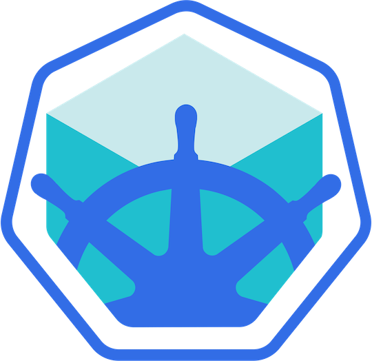
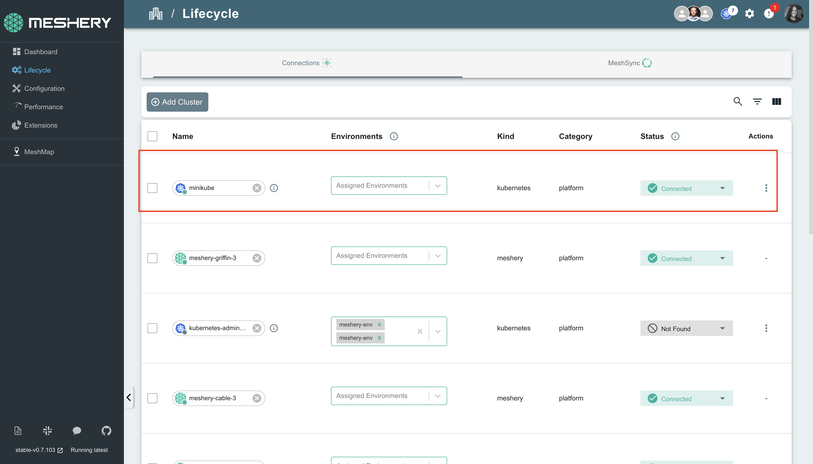

# Minikube

> Install Meshery on Minikube. Deploy Meshery in Minikube in-cluster or outside of Minikube out-of-cluster.

Source: /pr-preview/pr-21670/installation/kubernetes/minikube/

<h1>Quick Start with Minikube </h1>

Meshery can manage your minikube clusters and is particularly useful for multi-cluster management and deployments.

For Meshery to manage your Minikube cluster, it has to be discovered and added as a Kubernetes connection in the Meshery server.

After your cluster has been added as a connection, you can use Meshery to make infrastructure deployments of your [Meshery Designs](https://cloud.meshery.io/academy/learning-paths/11111111-1111-1111-1111-111111111111/mastering-meshery/introduction-to-meshery?chapter=creating-designs) to your cluster. To learn more about this, See [Deploying Meshery Designs](https://cloud.meshery.io/academy/learning-paths/11111111-1111-1111-1111-111111111111/mastering-meshery/introduction-to-meshery?chapter=deploying-meshery-designs).

**There are two ways to create this connection:**

1. Deploying Meshery in minikube [(in-cluster)](#in-cluster-installation).
2. Deploying Meshery using Docker and connect it to minikube [(out-of-cluster)](#out-of-cluster-installation).

**_Note: It is advisable to install Meshery in your Minikube clusters_**

<strong style="font-size: 20px;">Prerequisites</strong> 
 
  <ol>
    <li>Install the Meshery command-line client, <a href="/pr-preview/pr-21670/installation/mesheryctl/" class="meshery-light">mesheryctl</a>.</li>
    <li>Install <a href="https://kubernetes.io/docs/tasks/tools/">kubectl</a> on your local machine.</li>
    <li>Install <a href="https://minikube.sigs.k8s.io/docs/start/?arch=%2Fmacos%2Fx86-64%2Fstable%2Fbinary+download"> Minikube</a> on your local machine.</li>
    <li>Install <a href="https://helm.sh/docs/intro/install/">Helm</a>.</li>
  </ol>

Also see: [Install Meshery on Kubernetes](/pr-preview/pr-21670/installation/kubernetes/)

## Available Deployment Methods

- [In-cluster Installation](#in-cluster-installation)
  - [Installation: Install Meshery on Kubernetes Using `mesheryctl`](#installation-install-meshery-on-kubernetes-using-mesheryctl)
  - [Installation: Using Helm](#installation-using-helm)
- [Out-of-cluster Installation](#out-of-cluster-installation)
  - [Installation: Install Meshery on Docker](#installation-install-meshery-on-docker)
    - [Minikube Docker Driver Users](#minikube-docker-driver-users)
      - [Next Step: Update the Kubernetes API Server Address for Meshery Access](#next-step-update-the-kubernetes-api-server-address-for-meshery-access)
  - [Change the server address](#change-the-server-address)
- [Uploading Configuration File in the Meshery Web UI](#uploading-configuration-file-in-the-meshery-web-ui)
      - [Troubleshooting Meshery Installation](#troubleshooting-meshery-installation)
- [Post-Installation Steps](#post-installation-steps)
  
## Preflight Checks

Before deploying Meshery on minikube, complete the following initial setup tasks to prepare your environment.

### 1. Preflight: Cluster Connectivity

Start minikube using the following command if it is not already running:

<pre class="codeblock-pre">
	

		<code class="clipboardjs">minikube start</code>
	

</pre>

Check the status of your minikube cluster by running:

<pre class="codeblock-pre">
	

		<code class="clipboardjs">minikube status</code>
	

</pre>

Verify that the current context is set to minikube by running:

<pre class="codeblock-pre">
	

		<code class="clipboardjs">kubectl config current-context</code>
	

</pre>

### 2. Preflight: Meshery Authentication

Ensure you are logged in and [authenticated with Meshery](https://docs.meshery.io/guides/mesheryctl/authenticate-with-meshery-via-cli) by running the following command:

<pre class="codeblock-pre">
	

		<code class="clipboardjs">mesheryctl system login</code>
	

</pre>

# In-cluster Installation

## Installation: Install Meshery on Kubernetes Using `mesheryctl`

To install Meshery inside your minikube cluster, run the command:

<pre class="codeblock-pre">
	

		<code class="clipboardjs">mesheryctl system start -p kubernetes</code>
	

</pre>

This command deploys the Meshery Helm chart in the Meshery namespace.

To verify your deployment, run:

<pre class="codeblock-pre">
	

		<code class="clipboardjs">helm list -A -n meshery</code>
	

</pre>

After deployment, access the Meshery UI using port forwarding, with the command:

<pre class="codeblock-pre">
	

		<code class="clipboardjs">mesheryctl system dashboard --port-forward</code>
	

</pre>

For detailed instructions on port forwarding, refer to the [port-forwarding](/pr-preview/pr-21670/reference/references/mesheryctl/system/dashboard/) guide.

By default, Meshery auto-detects your Minikube cluster and establishes a connection. However, if this doesn’t happen, you can connect by running the following command:

<pre class="codeblock-pre">
	

		<code class="clipboardjs">mesheryctl system config minikube</code>
	

</pre>

The `mesheryctl system config minikube` command properly configures and uploads your kubeconfig file to the Meshery UI.

## Installation: Using Helm

You can deploy Meshery directly using the Helm CLI.
For detailed instructions on installing Meshery using Helm V3, please refer to the [Helm Installation](/pr-preview/pr-21670/installation/kubernetes/helm/) guide.

# Out-of-cluster Installation

To install Meshery on Docker(out-of-cluster) and connect it to your Minikube cluster, follow these steps:

## Installation: Install Meshery on Docker

Run the following command to start Meshery in a Docker environment:

<pre class="codeblock-pre">
	

		<code class="clipboardjs">mesheryctl system start -p docker</code>
	

</pre>

This will start Meshery in Docker containers. To verify that Meshery is running, use

<pre class="codeblock-pre">
	

		<code class="clipboardjs">docker ps</code>
	

</pre>

Meshery UI will be accessible on your local machine on port 9081. Open your browser and access Meshery at http://localhost:9081.

Configure Meshery to connect with your minikube cluster by running the command:

<pre class="codeblock-pre">
	

		<code class="clipboardjs">mesheryctl system config minikube</code>
	

</pre>

### Minikube Docker Driver Users

For users running minikube with the Docker driver, specific steps are needed to ensure that Meshery can connect properly to your minikube cluster.

If you set up your minikube cluster using the [Docker driver](https://minikube.sigs.k8s.io/docs/drivers/docker/), both minikube and Meshery will be running in Docker containers. So, you need to ensure that the Meshery and minikube containers can communicate with each other by placing them in the same Docker network.

To configure this, run the following commands:

<pre class="codeblock-pre">

 
docker network connect bridge meshery-meshery-1

</pre>

<pre class="codeblock-pre">

 
docker network connect minikube meshery-meshery-1

</pre>

Next, update the Kubernetes API server address in your kubeconfig file before running the `mesheryctl system config minikube` command. The steps to do this are outlined below.

#### Next Step: Update the Kubernetes API Server Address for Meshery Access

To allow the Meshery container to access your Minikube cluster (since both are running in containers), you need to update the Kubernetes API server address in your `kubeconfig file` to the `external minikube IP address`. This is necessary because Docker typically forwards ports to a localhost address, which isn’t accessible between containers.

To retrieve the Minikube IP, run the command `minikube ip`. To check which port minikube is using, run `docker ps` to view the container's port, which is typically `8443`.

Open the kubeconfig file and update the server address.

<pre class="codeblock-pre">
	

		<code class="clipboardjs">nano ~/.kube/config.yaml

## Change the server address

server: https://{minikubeIP}:{port}</code>
	

</pre>

`Ctrl + X` then enter `Y` to save and close the file.

Next, run the following command to configure Meshery to access your cluster.

<pre class="codeblock-pre">
	

		<code class="clipboardjs">mesheryctl system config minikube</code>
	

</pre>

**Note**: An alternative to running the mesheryctl system config minikube command for Meshery to discover your cluster is manually uploading your config file to the UI.

# Uploading Configuration File in the Meshery Web UI

**Note**: Meshery can only connect to your cluster if it is running locally (Kubernetes or Docker). Direct connections are not possible when using the hosted [Meshery Playground](https://playground.meshery.io/).

**To manually upload your kubeconfig file after running Meshery locally**:

1. In the Meshery UI, navigate to **Lifecycle** from the menu on the left.
2. Click on **Connections**.
3. Click on **Add Cluster** and search for your kubeconfig file.
4. Click **Import**.

**Note**:  If you encounter a connections refused error while uploading your kubeconfig, try changing your cluster server URL to the external API address of minikube. To do this follow the steps listed in the [Minikube Docker Driver Users Section](#docker-driver-update-the-kubernetes-api-server-address-for-meshery-access).

#### Troubleshooting Meshery Installation

If you experience any issues during installation, refer to the [Troubleshooting Meshery Installations](https://docs.meshery.io/guides/troubleshooting/installation#setting-up-meshery-using-kind-or-minikube) guide for help.

# Post-Installation Steps

Verify the health of your Meshery deployment, using <a href='/pr-preview/pr-21670/reference/references/mesheryctl/system/check/'>mesheryctl system check</a>.

<h2>Accessing Meshery UI</h2>

After successfully deploying Meshery, you can access Meshery's web-based user interface. Your default browser will automatically open and navigate to Meshery UI (default location is <a href="http://localhost:9081">http://localhost:9081</a>).

You can use the following command to open Meshery UI in your default browser:

<pre class="codeblock-pre" style="font-size: 1.75rem !important;">

<code class="clipboardjs">mesheryctl system dashboard</code>

</pre>

If you have installed Meshery on Kubernetes or a remote host, you can access Meshery UI by exposing it as a Kubernetes service or by port forwarding to Meshery UI.

<pre class="codeblock-pre" style="font-size: 1.75rem !important;">

<code class="clipboardjs">mesheryctl system dashboard --port-forward</code>

</pre>

Depending on how you have networking configured in Kubernetes, you can use kubectl to port forward to the Meshery UI.

<pre class="codeblock-pre" style="font-size: 1.75rem !important;">

<code class="clipboardjs">kubectl port-forward svc/meshery 9081:9081 --namespace meshery</code>

</pre>

<h4>Verify Kubernetes Connection</h4>

After installing Meshery, regardless of the installation type, it is important to verify that your kubeconfig file has been uploaded correctly via the UI. 

<ol>
<li>In the Meshery UI, navigate to <strong>Lifecycle</strong> from the menu on the left.</li>
<li>Click on Connections.</li>
<li>Ensure that your cluster appears in the list of connections and is marked as <code>Connected</code>.</li>
<li>Click on the cluster name to perform a ping test and confirm that Meshery can communicate with your cluster.</li>
</ol>

Customizing Your Meshery Provider Callback URL

  Meshery Server supports customizing your <a href="/pr-preview/pr-21670/reference/extensibility/providers/">Meshery Provider</a> authentication flow callback URL. This is helpful when deploying Meshery behind multiple layers of networking infrastructure.

  For production deployments, it is recommended to access the Meshery UI by setting up a reverse proxy or using a LoadBalancer. By specifying a custom redirect endpoint, you can ensure that authentication flows complete successfully, even when multiple routing layers are involved.

  <b>Note</b>: For production deployments, it is important to select the <code>Remote Provider</code> in order to control which identity providers are authorized. Learn more about this in the <a href="/pr-preview/pr-21670/reference/extensibility/providers/">Extensibility: Providers</a> guide.

  Define a custom callback URL by setting up the <code>MESHERY_SERVER_CALLBACK_URL</code> environment variable before installing Meshery.

  To customize the authentication flow callback URL, use the following command:

<pre class="codeblock-pre" style="font-size: 1.75rem !important;">

<code class="clipboardjs">MESHERY_SERVER_CALLBACK_URL=https://custom-host mesheryctl system start</code>

</pre>

  Meshery should now be running in your Kubernetes cluster and the Meshery UI should be accessible at the <code>EXTERNAL IP</code> of the <code>meshery</code> service.

  <h3>Recent Discussions with "meshery" Tag</h3><ul><li>
          <a href="https://discuss.meshery.io/t/design-meshery-mcp-server-architecture-and-registration-interface/7954" target="_blank" rel="noopener noreferrer">
            Design: Meshery MCP Server architecture and registration interface
          </a>
        </li><li>
          <a href="https://discuss.meshery.io/t/the-meshery-mcp-server-foundation-is-up-lets-agree-on-what-to-build-next/7952" target="_blank" rel="noopener noreferrer">
            The Meshery MCP Server foundation is up, let&#39;s agree on what to build next
          </a>
        </li><li>
          <a href="https://discuss.meshery.io/t/new-intro-topic/7975" target="_blank" rel="noopener noreferrer">
            New intro topic
          </a>
        </li><li>
          <a href="https://discuss.meshery.io/t/meshery-mcp-server-poc-an-ai-agent-managing-kubernetes-through-mcp/7974" target="_blank" rel="noopener noreferrer">
            Meshery MCP Server POC: an AI agent managing Kubernetes through MCP
          </a>
        </li><li>
          <a href="https://discuss.meshery.io/t/approach-for-context-window-aware-retrieval-in-the-ai-adapter-issue-20994/7963" target="_blank" rel="noopener noreferrer">
            Approach for context-window-aware retrieval in the AI Adapter (Issue #20994)
          </a>
        </li><li>
          <a href="https://discuss.meshery.io/t/there-is-some-error-in-running-the-localhost-of-layer5-in-my-server/7818" target="_blank" rel="noopener noreferrer">
            There is some error in running the localhost of layer5 in my server
          </a>
        </li><li>
          <a href="https://discuss.meshery.io/t/rfc-aligning-the-foundation-for-the-meshery-mcp-server/7913" target="_blank" rel="noopener noreferrer">
            RFC: Aligning the Foundation for the Meshery MCP Server
          </a>
        </li><li>
          <a href="https://discuss.meshery.io/t/meshery-development-meeting-august-12th-2026/7948" target="_blank" rel="noopener noreferrer">
            Meshery Development Meeting | August 12th, 2026
          </a>
        </li></ul>

    <a href="https://discuss.meshery.io/tag/meshery" target="_blank" rel="noopener noreferrer">
      View all discussions tagged with <code>meshery</code>
    </a>
  

