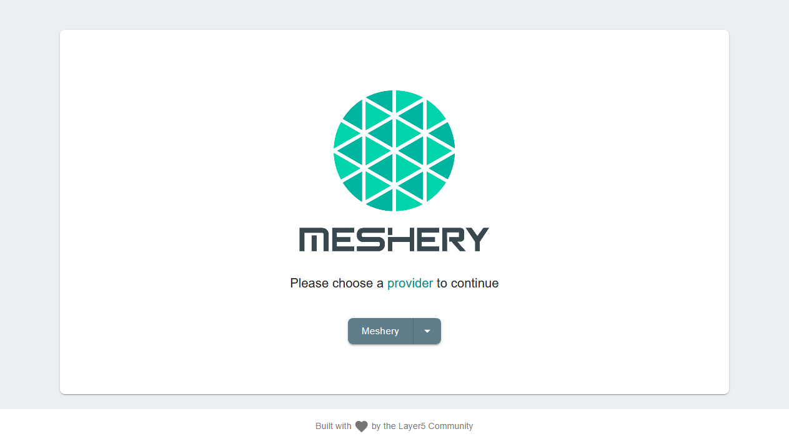
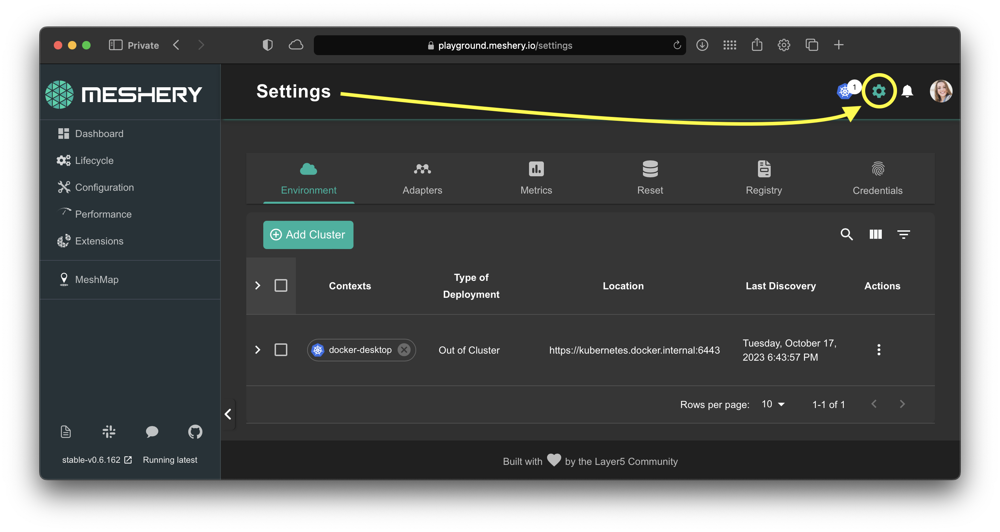
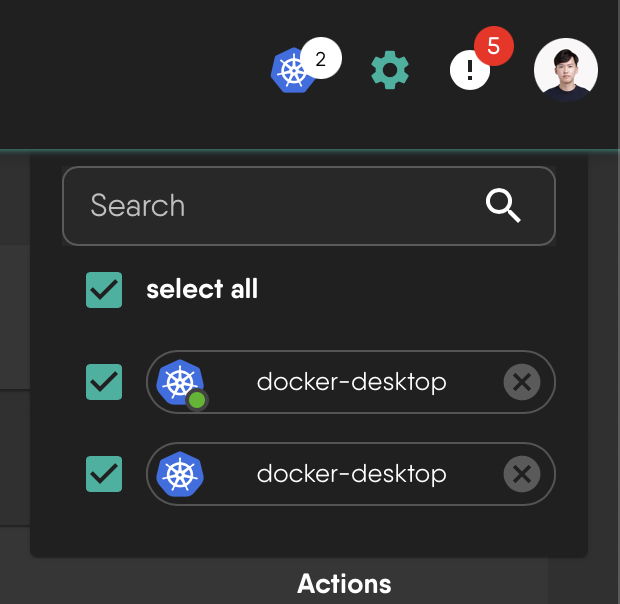
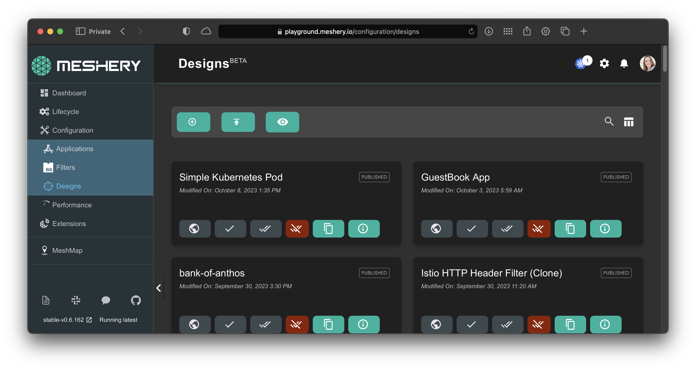

# Quick Start Guide

> Getting Meshery up and running locally on a Docker-enabled system or in Kubernetes is easy. Meshery deploys as a set of Docker containers, which can be deployed to either a Docker host or a Kubernetes cluster.

Source: /pr-preview/pr-21670/installation/quick-start/

Getting Meshery up and running locally on a Docker-enabled system or in Kubernetes is easy. Meshery deploys as a set of Docker containers, which can be deployed to either a Docker host or Kubernetes cluster.

Quick Start Assumptions

This quick start guide enables you to download, install, and run Meshery in a single command. See all <a href='/pr-preview/pr-21670/installation/'>supported platforms</a> for more specific (and less presumptuous) instructions.

## 1. Download, install, and run Meshery

If you are on a macOS or Linux system, you can download, install, and run both `mesheryctl` and Meshery Server by executing the following command.

<!-- <pre class="codeblock-pre" style="padding: 0; font-size:0px;">

  

    curl -L https://meshery.io/install | PLATFORM=kubernetes bash -
  

  

  

    curl -L https://meshery.io/install | PLATFORM=kubernetes bash -
  

</pre>-->
<!--  -->

<pre class="codeblock-pre">
  

  
curl -L https://meshery.io/install | PLATFORM=kubernetes bash -

  

</pre>
 

If you are on Windows, you can install `mesheryctl` using <a href="https://scoop.sh">Scoop</a> and start Meshery by executing:

<pre class="codeblock-pre">
  

  
scoop install mesheryctl
mesheryctl system start

  

</pre>

Meshery CLI

Meshery's command line interface, <code>mesheryctl</code>, can be installed in <a href='/pr-preview/pr-21670/installation/mesheryctl/'>various ways</a>. In addition to <a href='/pr-preview/pr-21670/installation/mesheryctl/linux-mac/bash/'>Bash</a>, you can also use <a href='/pr-preview/pr-21670/installation/mesheryctl/linux-mac/brew/'>Brew</a> or <a href='/pr-preview/pr-21670/installation/mesheryctl/windows/scoop/'>Scoop</a> to install <code>mesheryctl</code>. Alternatively, <code>mesheryctl</code> is also available via <a href='https://github.com/meshery/meshery/releases/latest'>direct download</a>.

## 2. Access Meshery

Your default browser will be opened and directed to Meshery's web-based user interface typically found at `http://localhost:9081`.

Accessing Meshery Server with Meshery UI

Meshery's web-based user interface is embedded in Meshery Server and is available as soon as Meshery starts. The location and port that Meshery UI is exposed varies depending upon your mode of deployment. See <a href='/pr-preview/pr-21670/installation/accessing-meshery-ui/'>accessing Meshery UI</a> for deployment-specific details.

Accessing Meshery Server with Meshery CLI

Meshery's command line interface is a client of Meshery Server's REST API (just as Meshery UI is). Choose to use <code>mesheryctl</code> as an alternative client as it suits your needs.

## 3. Select a Provider

Select from the list of [Providers](/pr-preview/pr-21670/reference/extensibility/providers/) in order to log in to Meshery. Authenticate with your chosen Provider.

## 4. Configure Connections to your Kubernetes Clusters

**Out-of-Cluster Deployments**
If you have deployed Meshery out-of-cluster, Meshery Server will automatically attempt to connect to any available Kubernetes clusters found in your kubeconfig (under `$HOME/.kube/config`) and in kubeconfigs uploaded through Meshery UI. By default, [MeshSync](/pr-preview/pr-21670/concepts/architecture/meshsync/) runs embedded inside Meshery Server and nothing is installed into your cluster. Only when a connection uses operator mode does Meshery Server deploy [Meshery Operator](/pr-preview/pr-21670/concepts/architecture/operator/), MeshSync, and Broker into the `meshery` namespace. To switch a connection between the two, see [MeshSync deployment modes](/pr-preview/pr-21670/guides/infrastructure-management/kubernetes-connection-lifecycle/#meshsync-deployment-modes).

**In-Cluster Deployments**
If you have deployed Meshery in-cluster, Meshery Server will automatically connect to the Kubernetes API Server available in the control plane.

Visit <i class="fas fa-cog"></i> Settings:

If your config has not been autodetected, you can manually upload your kubeconfig file (or any number of kubeconfig files). Meshery will attempt to connect to each reachable context contained in the imported kubeconfig files, using the default embedded mode unless that context's connection is set to operator mode. See [Managing Kubernetes Clusters](/pr-preview/pr-21670/installation/kubernetes/) for more information.

## 5. Verify Deployment

Run connectivity tests and verify the health of your Meshery system. Verify Meshery's connection to your Kubernetes clusters by clicking on the connection chip. A quick connectivity test will run and inform you of Meshery's ability to reach and authenticate to your Kubernetes control plane(s). You will be notified of your connection status. You can also verify any other connection between Meshery and either its components (like [Meshery Adapters](/pr-preview/pr-21670/concepts/architecture/adapters/)) or other managed infrastructure by clicking on any of the connection chips. When clicked, a chip will perform an ad hoc connectivity test.

If the Meshery Operator does not reach a healthy status, its status card and the connection's Diagnostics carry the reason - deploying the Operator needs outbound access to the Meshery chart repository, and Meshery retries resolution on each deploy, so a transient outage clears by redeploying. See [Meshery Operator and MeshSync troubleshooting](/pr-preview/pr-21670/guides/troubleshooting/meshery-operator-meshsync/).

## 6. Design and operate Kubernetes clusters and their workloads

You may now proceed to manage any cloud native infrastructure supported by Meshery. See all [integrations](/pr-preview/pr-21670/extensions/models/) for a complete list of supported infrastructure.

## Explore Tutorials

🧑‍🔬 Explore these tutorials to learn how to use Meshery for collaboratively managing infrastructure.

  
  
  
    
  
    
  
    
  
    
  
    
  
    
  
    
  
    
  
    
  
    
  
    
  
    
  
    
  
    
  
    
  
    
  
    
  
    
  
    
  
    
  
    
  
    
  
    
  
    
  
    
  
    
  
    
  
    
  
    
  
    
  
    
  
    
  
    
  
    
  
    
  
    
  
    
  
    
  
    
  
    
  
    
  
    
  
    
  
    
  
    
  
    
  
    
  
    
  
    
  
    
  
    
  
    
  
    
  
    
  
    
  
    
  
    
  
    
  
    
  
    
  
    
  
    
  
    
  
    
  
    
  
    
  
    
  
    
  
    
  
    
  
    
  
    
  
    
  
    
  
    
  
    
  
    
  
    
  
    
  
    
  
    
  
    
  
    
  
    
  
    
  
    
  
    
  
    
  
    
  
    
  
    
  
    
  
    
  
    
  
    
  
    
  
    
  
    
  
    
  
    
  
    
  
    
  
    
  
    
  
    
  
    
  
    
  
    
  
    
  
    
  
    
  
    
  
    
  
    
  
    
  
    
  
    
  
    
  
    
  
    
  
    
  
    
  
    
  
    
  
    
  
    
  
    
  
    
  
    
  
    
  
    
  
    
  
    
  
    
  
    
  
    
  
    
  
    
  
    
  
    
  
    
  
    
  
    
  
    
  
    
  
    
  
    
  
    
  
    
  
    
  
    
  
    
  
    
  
    
  
    
  
    
  
    
  
    
  
    
  
    
  
    
  
    
  
    
  
    
  
    
  
    
  
    
  
    
  
    
  
    
  
    
  
    
  
    
  
    
  
    
  
    
  
    
  
    
  
    
  
    
  
    
  
    
  
    
  
    
  
    
  
    
  
    
  
    
  
    
  
    
  
    
  
    
  
    
  
    
  
    
  
    
  
    
  
    
  
    
  
    
  
    
  
    
  
    
  
    
  
    
  
    
  
    
  
    
  
    
  
    
  
    
  
    
  
    
  
    
  
    
  
    
  
    
  
    
  
    
  
    
  
    
  
    
  
    
  
    
  
    
  
    
  
    
  
    
  
    
  
    
  
    
  
    
  
    
  
    
  
    
  
    
  
    
  
    
  
    
  
    
  
    
  
    
  
    
  
    
  
    
  
    
  
    
  
    
  
    
  
    
  
    
  
    
  
    
  
    
  
    
  
    
  
    
  
    
  
    
  
    
  
    
  
    
  
    
  
    
  
    
  
    
  
    
  
    
  
    
  
    
  
    
  
    
  
    
  
    
  
    
  
    
  
    
  
    
  
    
  
    
  
    
  
    
  
    
  
    
  
    
  
    
  
    
  
    
  
    
  
    
  
    
  
    
  
    
  
    
  
    
  
    
  
    
  
    
  
    
  
    
  
    
  
    
  
    
  
    
  
    
  
    
  
    
  
    
  
    
  
    
  
    
  
    
  
    
  
    
  
    
  
    
  
    
  
    
  
    
  
    
  
    
  
    
  
    
  
    
  
    
  
    
  
    
  
    
  
    
  
    
  
    
  
    
  
    
  
    
  
    
  
    
  
    
  
    
  
    
  
    
  
    
  
    
  
    
  
    
  
    
  
    
  
    
  
    
  
    
  
    
  
    
  
    
  
    
  
    
  
    
  
    
  
    
  
    
  
    
  
    
  
    
  
    
  
    
  
    
  
    
  
    
  
    
  
    
  
    
  
    
  
    
  
    
  
    
  
    
  
    
  
    
  
    
  
    
  
    
  
    
  
    
  
    
  
    
  
    
  
    
  
    
  
    
  
    
  
    
  
    
  
    
  
    
  
    
  
    
  
    
  
    
  
    
  
    
  
    
  
    
  
    
  
    
  
    
  
    
  
    
  
    
  
    
  
    
  
    
  
    
  
    
  
    
  
    
  
    
  
    
  
    
  
    
  
    
  
    
  
    
  
    
  
    
  
    
  
    
  
    
  
    
  
    
  
    
  
    
  
    
  
    
  
    
  
    
  
    
  
    
  
    
  
    
  
    
  
    
  
    
  
    
  
    
  
    
  
    
  
    
  
    
  
    
  
    
  
    
  
    
  
    
  
    
  
    
  
    
  
    
  
    
  
    
  
    
  
    
  
    
  
    
  
    
  
    
  
    
  
    
  
    
  
    
  
    
  
    
  
    
  
    
  
    
  
    
  
    
  
    
  
    
  
    
  
    
  
    
  
    
  
    
  
    
  
    
  
    
  
    
  
    
  
    
  
    
  
    
  
    
  
    
  
    
  
    
  
    
  
    
  
    
  
    
  
    
  
    
  
    
  
    
  
    
  
    
  
    
  
    
  
    
  
    
  
    
  
    
  
    
  
    
  
    
  
    
  
    
  
    
  
    
  
    
  
    
  
    
  
    
  
    
  
    
  
    
  
    
  
    
  
    
  
    
  
    
  
    
  
    
  
    
  
    
  
    
  
    
  
    
  
    
  
    
  
    
  
    
  
    
  
    
  
    
  
    
  
    
  
    
  
    
  
    
  
    
  
    
  
    
  
    
  
    
  
    
  
    
  
    
  
    
  
    
  
    
  
    
  
    
  
    
  
    
  
    
  
    
  
    
  
    
  
    
  
    
  
    
  
    
  
    
  
    
  
    
  
    
  
    
  
    
  
    
  
    
  
    
  
    
  
    
  
    
  
    
  
    
  
    
  
    
  
    
  
    
  
    
  
    
  
    
  
    
  
    
  
    
  
    
  
    
  
    
  
    
  
    
  
    
  
    
  
    
  
    
  
    
  
    
  
    
  
    
  
    
  
    
  
    
  
    
  
    
  
    
  
    
  
    
  
    
  
    
  
    
  
    
  
    
  
    
  
    
  
    
  
    
  
    
  
    
  
    
  
    
  
    
  
    
  
    
  
    
  
    
  
    
  
    
  
    
  
    
  
    
  
    
  
    
  
    
  
    
  
    
  
    
  
    
  
    
  
    
  
    
  
    
  
    
  
    
  
    
  
    
  
    
  
    
  
    
  
    
  
    
  
    
  
    
  
    
  
    
  
    
  
    
  
    
  
    
  
    
  
    
  
    
  
    
  
    
  
    
  
    
  
    
  
    
  
    
  
    
  
    
  
    
  
    
  
    
  
    
  
    
  
    
  
    
  
    
  
    
  
    
  
    
  
    
  
    
  
    
  
    
  
    
  
    
  
    
  
    
  
    
  
    
  
    
  
    
  
    
  
    
  
    
  
    
  
    
  
    
  
    
  
    
  
    
  
    
  
    
  
    
  
    
  
    
  
    
  
    
  
    
  
    
  
    
  
    
  
    
  
    
  
    
  
    
  
    
  
    
  
    
  
    
  
    
  
    
  
    
  
    
  
    
  
    
  
    
  
    
  
    
  
    
  
    
  
    
  
    
  
    
  
    
  
    
  
    
  
    
  
    
  
    
  
    
  
    
  
    
  
    
  
    
  
    
  
    
  
    
  
    
  
    
  
    
  
    
  
    
  
    
  
    
  
    
  
    
  
    
  
    
  
    
  
    
  
    
  
    
  
    
  
    
  
    
  
    
  
    
  
    
  
    
  
    
  
    
  
    
  
    
  
    
  
    
  
    
  
    
  
    
  
    
  
    
  
    
  
    
  
    
  
    
  
    
  
    
  
    
  
    
  
    
  
    
  
    
  
    
  
    
  
    
  
    
  
    
  
    
  
    
  
    
  
    
  
    
  
    
  
    
  
    
  
    
  
    
  
    
  
    
  
    
  
    
  
    
  
    
  
    
  
    
  
    
  
    
  
    
  
    
  
    
  
    
  
    
  
    
  
    
  
    
  
    
  
    
  
    
  
    
  
    
  
    
  
    
  
    
  
    
  
    
  
    
  
    
  
    
  
    
  
    
  
    
  
    
  
    
  
    
  
    
  
    
  
    
  
    
  
    
  
    
  
    
  
    
  
    
  
    
  
    
  
    
  
    
  
    
  
    
  
    
  
    
  
    
  
    
  
    
  
    
  
    
  
    
  
    
  
    
  
    
  
    
  
    
  
    
  
    
  
    
  
    
  
    
  
    
  
    
  
    
  
    
  
    
  
    
  
    
  
    
  
    
  
    
  
    
  
    
  
    
  
    
  
    
  
    
  
    
  
    
  
    
  
    
  
    
  
    
  
    
  
    
  
    
  
    
  
    
  
    
  
    
  
    
  
    
  
    
  
    
  
    
  
    
  
    
  
    
  
    
  
    
  
    
  
    
  
    
  
    
  
    
  
    
  
    
  
    
  
    
  
    
  
    
  
    
  
    
  
    
  
    
  
    
  
    
  
    
  
    
  
    
  
    
  
    
  
    
  
    
  
    
  
    
  
    
  
    
  
    
  
    
  
    
  
    
  
    
  
    
  
    
  
    
  
    
  
    
  
    
  
    
  
    
  
    
  
    
  
    
  
    
  
    
  
    
  
    
  
    
  
    
  
    
  
    
  
    
  
    
  
    
  
    
  
    
  
    
  
    
  
    
  
    
  
    
  
    
  
    
  
    
  
    
  
    
  
    
  
    
  
    
  
    
  
    
  
    
  
    
  
    
  
    
  
    
  
    
  
    
  
    
  
    
  
    
  
    
  
    
  
    
  
    
  
    
  
    
  
    
  
    
  
    
  
    
  
    
  
    
  
    
  
    
  
    
  
    
  
    
  
    
  
    
  
    
  
    
  
    
  
    
  
    
  
    
  
    
  
    
  
    
  
    
  
    
  
    
  
    
  
    
  
    
  
    
  
    
  
    
  
    
  
    
  
    
  
    
  
    
  
    
  
    
  
    
  
    
  
    
  
    
  
    
  
    
  
    
  
    
  
    
  
    
  
    
  
    
  
    
  
    
  
    
  
    
  
    
  
    
  
    
  
    
  
    
  
    
  
    
  
    
  
    
  
    
  
    
  
    
  
    
  
    
  
    
  
    
  
    
  
    
  
    
  
    
  
    
  
    
  
    
  
    
  
    
  
    
  
    
  
    
  
    
  
    
  
    
  
    
  
    
  
    
  
    
  
    
  
    
  
    
  
    
  
    
  
    
  
    
  
    
  
    
  
    
  
    
  
    
  
    
  
    
  
    
  
    
  
    
  
    
  
    
  
    
  
    
  
    
  
    
  
    
  
    
  
    
  
    
  
    
  
    
  
    
  
    
  
    
  
    
  
    
  
    
  
    
  
    
  
    
  
    
  
    
  
    
  
    
  
    
  
    
  
    
  
    
  
    
  
    
  
    
  
    
  
    
  
    
  
    
  
    
  
    
  
    
  
    
  
    
  
    
  
    
  
    
  
    
  
    
  
    
  
    
  
    
  
    
  
    
  
    
  
    
  
    
  
    
  
    
  
    
  
    
  
    
  
    
  
    
  
    
  
    
  
    
  
    
  
    
  
    
  
    
  
    
  
    
  
    
  
    
  
    
  
    
  
    
  
    
  
    
  
    
  
    
  
    
  
    
  
    
  
    
  
    
  
    
  
    
  
    
  
    
  
    
  
    
  
    
  
    
  
    
  
    
  
    
  
    
  
    
  
    
  
    
  
    
  
    
  
    
  
    
  
    
  
    
  
    
  
    
  
    
  
    
  
    
  
    
  
    
  
    
  
    
  
    
  
    
  
    
  
    
  
    
  
    
  
    
  
    
  
    
  
    
  
    
  
    
  
    
  
    
  
    
  
    
  
    
  
    
  
    
  
    
  
    
  
    
  
    
  
    
  
    
  
    
  
    
  
    
  
    
  
    
  
    
  
    
  
    
  
    
  
    
  
    
  
    
  
    
  
    
  
    
  
    
  
    
  
    
  
    
  
    
  
    
  
    
  
    
  
    
  
    
  
    
  
    
  
    
  
    
  
    
  
    
  
    
  
    
  
    
  
    
  
    
  
    
  
    
  
    
  
    
  
    
  
    
  
    
  
    
  
    
  
    
  
    
  
    
  
    
  
    
  
    
  
    
  
    
  
    
  
    
  
    
  
    
  
    
  
    
  
    
  
    
  
    
  
    
  
    
  
    
  
    
  
    
  
    
  
    
  
    
  
    
  
    
  
    
  
    
  
    
  
    
  
    
  
    
  
    
  
    
  
    
  
    
  
    
  
    
  
    
  
    
  
    
  
    
  
    
  
    
  
    
  
    
  
    
  
    
  
    
  
    
  
    
  
    
  
    
  
    
  
    
  
    
  
    
  
    
  
    
  
    
  
    
  
    
  
    
  
    
  
    
  
    
  
    
  
    
  
    
  
    
  
    
  
    
  
    
  
    
  
    
  
    
  
    
  
    
  
    
  
    
  
    
  
    
  
    
  
    
  
    
  
    
  
    
  
    
  
    
  
    
  
    
  
    
  
    
  
    
  
    
  
    
  
    
  
    
  
    
  
    
  
    
  
    
  
    
  
    
  
    
  
    
  
    
  
    
  
    
  
    
  
    
  
    
  
    
  
    
  
    
  
    
  
    
  
    
  
    
  
    
  
    
  
    
  
    
  
    
  
    
  
    
  
    
  
    
  
    
  
    
  
    
  
    
  
    
  
    
  
    
  
    
  
    
  
    
  
    
  
    
  
    
  
    
  
    
  
    
  
    
  
    
  
    
  
    
  
    
  
    
  
    
  
    
  
    
  
    
  
    
  
    
  
    
  
    
  
    
  
    
  
    
  
    
  
    
  
    
  
    
  
    
  
    
  
    
  
    
  
    
  
    
  
    
  
    
  
    
  
    
  
    
  
    
  
    
  
    
  
    
  
    
  
    
  
    
  
    
  
    
  
    
  
    
  
    
  
    
  
    
  
    
  
    
  
    
  
    
  
    
  
    
  
    
  
    
  
    
  
    
  
    
  
    
  
    
  
    
  
    
  
    
  
    
  
    
  
    
  
    
  
    
  
    
  
    
  
    
  
    
  
    
  
    
  
    
  
    
  
    
  
    
  
    
  
    
  
    
  
    
  
    
  
    
  
    
  
    
  
    
  
    
  
    
  
    
  
    
  
    
  
    
  
    
  
    
  
    
  
    
  
    
  
    
  
    
  
    
  
    
  
    
  
    
  
    
  
    
  
    
  
    
  
    
  
    
  
    
  
    
  
    
  
    
  
    
  
    
  
    
  
    
  
    
  
    
  
    
  
    
  
    
  
    
  
    
  
    
  
    
  
    
  
    
  
    
  
    
  
    
  
    
  
    
  
    
  
    
  
    
  
    
  
    
  
    
  
    
  
    
  
    
  
    
  
    
  
    
  
    
  
    
  
    
  
    
  
    
  
    
  
    
  
    
  
    
  
    
  
    
  
    
  
    
  
    
  
    
  
    
  
    
  
    
  
    
  
    
  
    
  
    
  
    
  
    
  
    
  
    
  
    
  
    
  
    
  
    
  
    
  
    
  
    
  
    
  
    
  
    
  
    
  
    
  
    
  
    
  
    
  
    
  
    
  
    
  
    
  
    
  
    
  
    
  
    
  
    
  
    
  
    
  
    
  
    
  
    
  
    
  
    
  
    
  
    
  
    
  
    
  
    
  
    
  
    
  
    
  
    
  
    
  
    
  
    
  
    
  
    
  
    
  
    
  
    
  
    
  
    
  
    
  
    
  
    
  
    
  
    
  
    
  
    
  
    
  
    
  
    
  
    
  
    
  
    
  
    
  
    
  
    
  
    
  
    
  
    
  
    
  
    
  
    
  
    
  
    
  
    
  
    
  
    
  
    
  
    
  
    
  
    
  
    
  
    
  
    
  
    
  
    
  
    
  
    
  
    
  
    
  
    
  
    
  
    
  
    
  
    
  
    
  
    
  
    
  
    
  
    
  
    
  
    
  
    
  
    
  
    
  
    
  
    
  
    
  
    
  
    
  
    
  
    
  
    
  
    
  
    
  
    
  
    
  
    
  
    
  
    
  
    
  
    
  
    
  
    
  
    
  
    
  
    
  
    
  
    
  
    
  
    
  
    
  
    
  
    
  
    
  
    
  
    
  
    
  
    
  
    
  
    
  
    
  
    
  
    
  
    
  
    
  
    
  
    
  
    
  
    
  
    
  
    
  
    
  
    
  
    
  
    
  
    
  
    
  
    
  
    
  
    
  
    
  
    
  
    
  
    
  
    
  
    
  
    
  
    
  
    
  
    
  
    
  
    
  
    
  
    
  
    
  
    
  
    
  
    
  
    
  
    
  
    
  
    
  
    
  
    
  
    
  
    
  
    
  
    
  
    
  
    
  
    
  
    
  
    
  
    
  
    
  
    
  
    
  
    
  
    
  
    
  
    
  
    
  
    
  
    
  
    
  
    
  
    
  
    
  
    
  
    
  
    
  
    
  
    
  
    
  
    
  
    
  
    
  
    
  
    
  
    
  
    
  
    
  
    
  
    
  
    
  
    
  
    
  
    
  
    
  
    
  
    
  
    
  
    
  
    
  
    
  
    
  
    
  
    
  
    
  
    
  
    
  
    
  
    
  
    
  
    
  
    
  
    
  
    
  
    
  
    
  
    
  
    
  
    
  
    
  
    
  
    
  
    
  
    
  
    
  
    
  
    
  
    
  
    
  
    
  
    
  
    
  
    
  
    
  
    
  
    
  
    
  
    
  
    
  
    
  
    
  
    
  
    
  
    
  
    
  
    
  
    
  
    
  
    
  
    
  
    
  
    
  
    
  
    
  
    
  
    
  
    
  
    
  
    
  
    
  
    
  
    
  
    
  
    
  
    
  
    
  
    
  
    
  
    
  
    
  
    
  
    
  
    
  
    
  
    
  
    
  
    
  
    
  
    
  
    
  
    
  
    
  
    
  
    
  
    
  
    
  
    
  
    
  
    
  
    
  
    
  
    
  
    
  
    
  
    
  
    
  
    
  
    
  
    
  
    
  
    
  
    
  
    
  
    
  
    
  
    
  
    
  
    
  
    
  
    
  
    
  
    
  
    
  
    
  
    
  
    
  
    
  
    
  
    
  
    
  
    
  
    
  
    
  
    
  
    
  
    
  
    
  
    
  
    
  
    
  
    
  
    
  
    
  
    
  
    
  
    
  
    
  
    
  
    
  
    
  
    
  
    
  
    
  
    
  
    
  
    
  
    
  
    
  
    
  
    
  
    
  
    
  
    
  
    
  
    
  
    
  
    
  
    
  
    
  
    
  
    
  
    
  
    
  
    
  
    
  
    
  
    
  
    
  
    
  
    
  
    
  
    
  
    
  
    
  
    
  
    
  
    
  
    
  
    
  
    
  
    
  
    
  
    
  
    
  
    
  
    
  
    
  
    
  
    
  
    
  
    
  
    
  
    
  
    
  
    
  
    
  
    
  
    
  
    
  
    
  
    
  
    
  
    
  
    
  
    
  
    
  
    
  
    
  
    
  
    
  
    
  
    
  
    
  
    
  
    
  
    
  
    
  
    
  
    
  
    
  
    
  
    
  
    
  
    
  
    
  
    
  
    
  
    
  
    
  
    
  
    
  
    
  
    
  
    
  
    
  
    
  
    
  
    
  
    
  
    
  
    
  
    
  
    
  
    
  
    
  
    
  
    
  
    
  
    
  
    
  
    
  
    
  
    
  
    
  
    
  
    
  
    
  
    
  
    
  
    
  
    
  
    
  
    
  
    
  
    
  
    
  
    
  
    
  
    
  
    
  
    
  
    
  
    
  
    
  
    
  
    
  
    
  
    
  
    
  
    
  
    
  
    
  
    
  
    
  
    
  
    
  
    
  
    
  
    
  
    
  
    
  
    
  
    
  
    
  
    
  
    
  
    
  
    
  
    
  
    
  
    
  
    
  
    
  
    
  
    
  
    
  
    
  
    
  
    
  
    
  
    
  
    
  
    
  
    
  
    
  
    
  
    
  
    
  
    
  
    
  
    
  
    
  
    
  
    
  
    
  
    
  
    
  
    
  
    
  
    
  
    
  
    
  
    
  
    
  
    
  
    
  
    
  
    
  
    
  
    
  
    
  
    
  
    
  
    
  
    
  
    
  
    
  
    
  
    
  
    
  
    
  
    
  
    
  
    
  
    
  
    
  
    
  
    
  
    
  
    
  
    
  
    
  
    
  
    
  
    
  
    
  
    
  
    
  
    
  
    
  
    
  
    
  
    
  
    
  
    
  
    
  
    
  
    
  
    
  
    
  
    
  
    
  
    
  
    
  
    
  
    
  
    
  
    
  
    
  
    
  
    
  
    
  
    
  
    
  
    
  
    
  
    
  
    
  
    
  
    
  
    
  
    
  
    
  
    
  
    
  
    
  
    
  
    
  
    
  
    
  
    
  
    
  
    
  
    
  
    
  
    
  
    
  
    
  
    
  
    
  
    
  
    
  
    
  
    
  
    
  
    
  
    
  
    
  
    
  
    
  
    
  
    
  
    
  
    
  
    
  
    
  
    
  
    
  
    
  
    
  
    
  
    
  
    
  
    
  
    
  
    
  
    
  
    
  
    
  
    
  
    
  
    
  
    
  
    
  
    
  
    
  
    
  
    
  
    
  
    
  
    
  
    
  
    
  
    
  
    
  
    
  
    
  
    
  
    
  
    
  
    
  
    
  
    
  
    
  
    
  
    
  
    
  
    
  
    
  
    
  
    
  
    
  
    
  
    
  
    
  
    
  
    
  
    
  
    
  
    
  
    
  
    
  
    
  
    
  
    
  
    
  
    
  
    
  
    
  
    
  
    
  
    
  
    
  
    
  
    
  
    
  
    
  
    
  
    
  
    
  
    
  
    
  
    
  
    
  
    
  
    
  
    
  
    
  
    
  
    
  
    
      
    
  
    
      
    
  
    
      
    
  
    
  
    
  
    
  
    
  
    
  
    
  
    
  
    
  
    
  
    
  
    
  
    
  
    
  
    
  
    
  
    
  
    
  
    
      
    
  
    
  
    
  
    
  
    
  
    
  
    
  
    
  
    
  
    
  
    
  
    
  
    
  
    
  
    
  
    
  
    
  
    
  
    
  
    
  
    
  
    
  
    
  
    
  
    
  
    
  
    
  
    
  
    
  
    
  
    
  
    
  
    
  
    
  
    
  
    
  
    
  
    
  
    
  
    
  
    
  
    
  
    
  
    
  
    
  
    
  
    
  
    
  
    
  
    
  
    
  
    
  
    
  
    
  
    
  
    
  
    
  
    
  
    
  
    
  
    
  
    
  
    
  
    
  
    
  
    
  
    
  
    
  
    
  
    
  
    
  
    
  
    
  
    
  
    
  
    
  
    
  
    
  
    
  
    
  
    
  
    
  
    
  
    
  
    
  
    
  
    
  
    
  
    
  
    
  
    
  
    
  
    
  
    
  
    
  
    
  
    
  
    
  
    
  
    
  
    
  
    
  
    
  
    
  
    
  
    
  
    
  
    
  
    
  
    
  
    
  
    
  
    
  
    
  
    
  
    
  
    
  
    
  
    
  
    
  
    
  
    
  
    
  
    
  
    
  
    
  
    
  
    
  
    
  
    
  
    
  
    
  
    
  
    
  
    
  
    
  
    
  
    
  
    
  
    
  
    
  
    
  
    
  
    
  
    
  
    
  
    
  
    
  
    
  
    
  
    
  
    
  
    
  
    
  
    
  
    
  
    
  
    
  
    
  
    
  
    
  
    
  
    
  
    
  
    
  
    
  
    
  
    
  
    
  
    
  
    
  
    
  
    
  
    
  
    
  
    
  
    
  
    
  
    
  
    
  
    
  
    
  
    
  
    
  
    
  
    
  
    
  
    
  
    
  
    
  
    
  
    
  
    
  
    
  
    
  
    
  
    
  
    
  
    
  
    
  
    
  
    
  
    
  
    
  
    
  
    
  
    
  
    
  
    
  
    
  
    
  
    
  
    
  
    
  
    
  
    
  
    
  
    
  
    
  
    
  
    
  
    
  
    
  
    
  
    
  
    
  
    
  
    
  
    
  
    
  
    
  
    
  
    
  
    
  
    
  
    
  
    
  
    
  
    
  
    
  
    
  
    
  
    
  
    
  
    
  
    
  
    
  
    
  
    
  
    
  
    
  
    
  
    
  
    
  
    
  
    
  
    
  
    
  
    
  
    
  
    
  
    
  
    
  
    
  
    
  
    
  
    
  
    
  
    
  
    
  
    
  
    
  
    
  
    
  
    
  
    
  
    
  
    
  
    
  
    
  
    
  
    
  
    
  
    
  
    
  
    
  
    
  
    
  
    
  
    
  
    
  
    
  
    
  
    
  
    
  
    
  
    
  
    
  
    
  
    
  
    
  
    
  
    
  
    
  
    
  
    
  
    
  
    
  
    
  
    
  
    
  
    
  
    
  
    
  
    
  
    
  
    
  
    
  
    
  
    
  
    
  
    
  
    
  
    
  
    
  
    
  
    
  
    
  
    
  
    
  
    
  
    
  
    
  
    
  
    
  
    
  
    
  
    
  
    
  
    
  
    
  
    
  
    
  
    
  
    
  
    
  
    
  
    
  
    
  
    
      
    
  
    
  
    
  
    
  
    
  
    
  
    
  
    
  
    
  
    
  
    
  
    
  
    
  
    
  
    
  
    
  
    
  
    
  
    
  
    
  
    
  
    
  
    
  
    
  
    
  
    
  
    
  
    
  
    
  
    
  
    
  
    
  
    
  
    
  
    
  
    
  
    
  
    
  
    
  
    
  
    
  
    
  
    
  
    
  
    
  
    
  
    
  
    
  
    
  
    
  
    
  
    
  
    
  
    
  
    
  
    
  
    
  
    
  
    
  
    
  
    
  
    
  
    
  
    
  
    
  
    
  
    
  
    
  
    
  
    
  
    
  
    
  
    
  
    
  
    
  
    
  
    
  
    
  
    
  
    
  
    
  
    
  
    
  
  
  
  
  
  
    
      
      <strong>ARTIFACTHUB</strong>
      <ul style="list-style-type: circle;">
      
    
    <li><a href="/pr-preview/pr-21670/guides/tutorials/artifacthub/publish-to-artifacthub/">Publishing Meshery Designs to Artifact Hub</a></li>
  
    
      </ul>
      <strong>AWS</strong>
      <ul style="list-style-type: circle;">
      
    
    <li><a href="/pr-preview/pr-21670/guides/tutorials/aws/deploy-aws-ec2-instances-with-meshery/">Deploy AWS EC2 Instances with Meshery</a></li>
  
    
      </ul>
      <strong>AZURE</strong>
      <ul style="list-style-type: circle;">
      
    
    <li><a href="/pr-preview/pr-21670/guides/tutorials/azure/deploy-azure-resources-with-meshery/">Deploy Azure resources with Meshery</a></li>
  
    
    <li><a href="/pr-preview/pr-21670/guides/tutorials/azure/deploy-azure-storage-account-with-meshery/">Deploy Azure Storage Account with Meshery</a></li>
  
    
      </ul>
      <strong>WORDPRESS</strong>
      <ul style="list-style-type: circle;">
      
    
    <li><a href="/pr-preview/pr-21670/guides/tutorials/wordpress/embedding-meshery-design-in-wordpress/">Embedding a Meshery Design in a WordPress Post</a></li>
  
  </ul>

## Additional Guides

    <ul>
        <li><a href="/pr-preview/pr-21670/guides/troubleshooting/installation/">Troubleshooting Meshery Installations</a></li>
        <li><a href="/pr-preview/pr-21670/reference/references/error-codes/">Meshery Error Code Reference</a></li>
        <li><a href="/pr-preview/pr-21670/reference/references/mesheryctl/system/check/">mesheryctl system check</a></li> 
    </ul>

