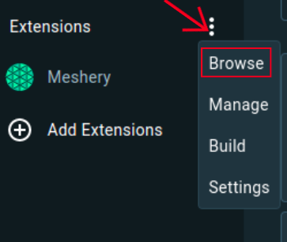
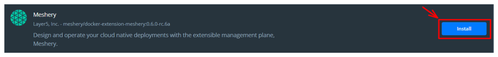

# Contributing to Meshery Docker Extension

> How to contribute to Meshery Docker Extension

Source: /pr-preview/pr-21670/project/contributing/contributing-docker-extension/

## Prerequisites
To start contributing to Meshery Docker Extension, make sure you have [Docker](https://docs.docker.com/get-docker/) installed on your system.
### Docker Extension for Meshery

The Docker Extension for Meshery extends Docker Desktop’s position as the cloud native developer’s go-to Kubernetes environment with easy access to the next layer of cloud native infrastructure. The extension provides a seamless experience for developers to manage and monitor their Kubernetes applications and services.

#### Using Docker Desktop

1) Navigate to the Extensions Marketplace of Docker Desktop.

2) From the Dashboard, select Add Extensions in the menu bar or open the Extensions Marketplace from the menu options.

3) Navigate to Meshery in the Marketplace and press install.

OR

You can visit the [Docker Hub](https://hub.docker.com/extensions/meshery/docker-extension-meshery) marketplace to directly install Meshery extension in your Docker Desktop.

#### Using `Docker CLI`

Meshery runs as a set of containers inside your Docker Desktop virtual machine.

<pre class="codeblock-pre">
	

		<code class="clipboardjs">docker extension install meshery/docker-extension-meshery</code>
	

</pre>

## Set up the server

In the root directory of meshery, run the following command:

### To install/update the UI dependencies:

<pre class="codeblock-pre">
	

		<code class="clipboardjs">make ui-setup</code>
	

</pre>

### Start the server locally

<pre class="codeblock-pre">
	

		<code class="clipboardjs">make server</code>
	

</pre>

This will ensure that the server is up and running at port 9081

## Set up docker extension Locally

Open another terminal while the server is running,
Go inside the docker-extension directory 

<pre class="codeblock-pre">
	

		<code class="clipboardjs">cd install/docker-extension</code>
	

</pre>

### Build and export UI

<pre class="codeblock-pre">
	

		<code class="clipboardjs">make ui-build</code>
	

</pre>

### UI Development Server

If you want to work on the Docker UI, it will be a good idea to use the included UI development server. You can run the UI development server by running the following command:

<pre class="codeblock-pre">
	

		<code class="clipboardjs">make ui</code>
	

</pre>

Now the meshery docker-extension is up and running.

### Linking the docker extension locally
To see the changes reflected in the docker extension locally and open the devTools window, we can run the command:

<pre class="codeblock-pre">
	

		<code class="clipboardjs">make link</code>
	

</pre>

Now that our local development environment is connected with the meshery docker extension, we can start contributing to it.
