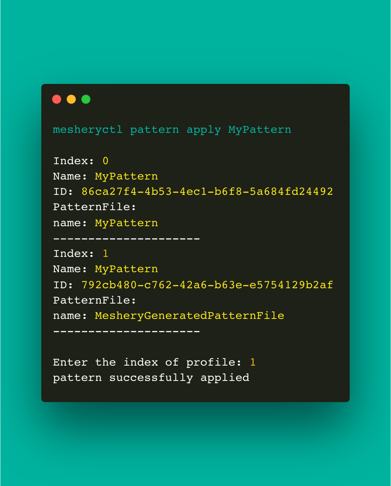

# mesheryctl-design-apply

Source: /pr-preview/pr-21670/reference/references/mesheryctl/design/apply/

# mesheryctl design apply

Apply design file

## Synopsis

Apply design will trigger deploy of the design file.
	
<pre class='codeblock-pre'>

mesheryctl design apply [flags]

</pre> 

## Examples

apply a design file
<pre class='codeblock-pre'>

mesheryctl design apply -f [file | URL]

</pre> 

deploy a saved design
<pre class='codeblock-pre'>

mesheryctl design apply [design-name]

</pre> 

## Options

<pre class='codeblock-pre'>

  -f, --file string   Path to design file
  -h, --help          help for apply
      --skip-save     Skip saving a design

</pre>

## Options inherited from parent commands

<pre class='codeblock-pre'>

      --config string   path to config file (default "/home/runner/.meshery/config.yaml")
  -t, --token string    Path to token file default from current context
  -v, --verbose         verbose output

</pre>

## Screenshots

Usage of mesheryctl design apply

## See Also

Go back to [command reference index](/pr-preview/pr-21670/reference/references/mesheryctl/), if you want to add content manually to the CLI documentation, please refer to the [instruction](/pr-preview/pr-21670/project/contributing/cli/cli/#preserving-manually-added-documentation) for guidance.
