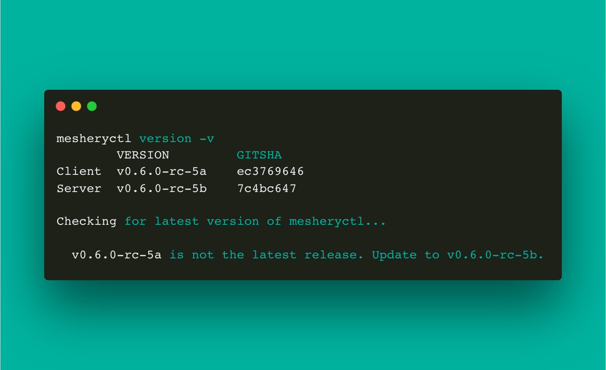

# mesheryctl-version

Source: /pr-preview/pr-21670/reference/references/mesheryctl/version/

# mesheryctl version

Show Meshery CLI and Server versions

## Synopsis

Version of Meshery command line client - mesheryctl.
<pre class='codeblock-pre'>

mesheryctl version [flags]

</pre> 

## Examples

To view the current version and SHA of release binary of mesheryctl client 
<pre class='codeblock-pre'>

mesheryctl version

</pre> 

## Options

<pre class='codeblock-pre'>

  -h, --help   help for version

</pre>

## Options inherited from parent commands

<pre class='codeblock-pre'>

      --config string   path to config file (default "/home/runner/.meshery/config.yaml")
  -v, --verbose         verbose output

</pre>

## Screenshots

Usage of mesheryctl version

## See Also

Go back to [command reference index](/pr-preview/pr-21670/reference/references/mesheryctl/), if you want to add content manually to the CLI documentation, please refer to the [instruction](/pr-preview/pr-21670/project/contributing/cli/cli/#preserving-manually-added-documentation) for guidance.
